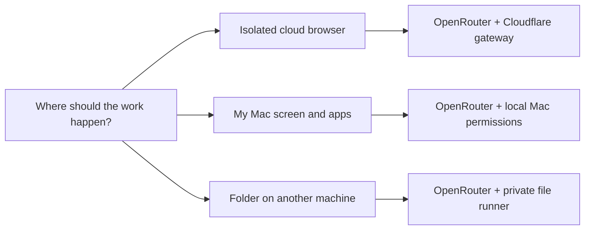

<p align="center">
  
</p>

<h1 align="center">Grokky</h1>

<p align="center"><strong>Chat, build, and work with AI agents. Choose where they work and see what they do.</strong></p>

<p align="center">
  <a href="https://github.com/earlyaidopters/grokky/actions/workflows/verify.yml"></a>
  
  
  
</p>

Grokky is a desktop workspace for **Codex** and **OpenRouter**. Ask for help in a conversation, work on a project folder, bring in specialist agents, or give an agent a browser it can operate. Assignments, reports, tool actions, approvals, and usage appear alongside the conversation.

**Source version: 0.1.9.** This guide describes this checkout. An older downloaded installer may not contain these features; check the build's version and source commit.

[Install](#install-grokky) · [Connect a provider](#connect-a-provider) · [Set up computer use](#set-up-computer-use) · [Use agents](#use-agents) · [Troubleshooting](#troubleshooting) · [Develop](#development-quick-start)

## Choose your setup

You only need a model provider to start chatting. Computer use is optional.

| I want to… | Use | What I need |
| --- | --- | --- |
| Chat, plan, or work on local code | Codex or OpenRouter | A Codex sign-in or an OpenRouter API key |
| Run local project tests and development commands | Codex | A project folder and **Full access** |
| Have an agent navigate websites, click, and fill forms in an isolated browser | OpenRouter + Cloudflare computer | A deployed gateway URL and a one-time enrollment key |
| Capture my Mac's screen or operate a local app | OpenRouter + this Mac | macOS screen and Accessibility permissions |
| Let an agent read or edit a folder on another machine | OpenRouter + private file runner | A runner endpoint and its pairing code |

The **Cloudflare computer** is a separate browser and disposable Linux workspace. It does not start with your personal browser logins or a copy of your local project. The **private runner** exposes bounded files; it does not provide a desktop or shell.

## Install Grokky

### Download an installer

1. Open the [Verify workflow](https://github.com/earlyaidopters/grokky/actions/workflows/verify.yml).
2. Choose a successful **main** run with completed package jobs. Check its commit.
3. Under **Artifacts**, download `Grokky-macOS-arm64` or `Grokky-Windows-x64`. You may need to sign in to GitHub to download it.
4. Unzip the download, then install:

| Platform | Install | Computer-use support |
| --- | --- | --- |
| Apple Silicon Mac | Open the `.dmg`, drag **Grokky.app** to **Applications**, then launch it | Cloud computer and macOS local controls |
| Windows x64 | Run the `.exe` installer, then launch Grokky | Cloud computer; local Windows screen/app control is not implemented |

Installers are currently unsigned development builds. Only open an artifact whose repository and producing commit you trust. See the [Windows guide](docs/WINDOWS.md) for Windows-specific installation and troubleshooting.

Artifacts expire after **14 days**. Pull requests run checks but do not produce installers; a push to `main` or a manually dispatched workflow can produce them after verification. If no suitable artifact exists, [run from source](#development-quick-start). There is no automatic updater or packaged Linux/Intel Mac target in this repository.

Running the packaged app does not require Node.js, Docker, or Wrangler. A separate Codex CLI installation may be needed to establish your Codex sign-in. Docker and Wrangler are only needed by someone deploying the cloud gateway.

## Connect a provider

Configure either provider, or both. Use the provider selector at the top of a conversation to switch.

### Codex SDK setup

Grokky uses the official Codex SDK and your saved Codex sign-in.

1. If you already use the Codex CLI, keep that existing installation and sign-in. Otherwise follow the [official CLI installation guide](https://learn.chatgpt.com/docs/codex/cli). With Node.js/npm installed, the npm route is:

   ```bash
   npm install -g @openai/codex
   codex login
   ```

2. Complete the sign-in flow on the same operating-system account that will run Grokky.
3. Open or restart Grokky, select **Codex**, and choose a model available to your account.

Grokky reuses the usual Codex auth directory, or `CODEX_HOME` if configured. A ChatGPT API key pasted into a chat is not a setup step. The packaged app includes its own verified Codex executable for SDK execution.

For a first check, leave the conversation in **No project** and send:

> Suggest three short names for a fictional gardening club. Use only the text in this message.

**Success looks like:** an answer in the conversation without a folder, cloud-device, or command-access requirement. Account/model errors still need to be resolved even when a saved sign-in is detected.

[Codex integration details →](docs/CODEX-SDK.md)

### OpenRouter setup

1. Create an API key in your [OpenRouter account](https://openrouter.ai/settings/keys), with access to the models you want to use.
2. Save it in a plain-text `.env` file **outside the repository**, with this format:

   ```dotenv
   OPENROUTER_API_KEY=replace_with_your_key
   ```

3. In Grokky, select **OpenRouter** in the conversation toolbar.
4. Open **Settings → Session → OpenRouter credential**, then choose that file. New installs also offer an OpenRouter file picker in **Quick setup**.
5. Choose a valid OpenRouter model ID. For computer use and delegation, choose a model that supports tool calling; screen-based work also needs image input. `openai/gpt-5.2` is the app's default.
6. Send the same fictional-club prompt above to check that the provider responds.

The file picker stores the path. The key is read by the main process and is not sent to the interface or stored as chat content. Do not paste keys into conversations, screenshots, issues, or commits.

<details>
<summary>Other supported credential sources</summary>

The resolver checks these in order:

1. `OPENROUTER_API_KEY` inherited by the app process.
2. The env file selected in Settings.
3. The env file named by `GROKKY_OPENROUTER_ENV_FILE`.
4. `$HOME/.config/grokky/.env`.

An app launched from Finder or the Start menu may not inherit your terminal's environment. Choosing a file in Settings avoids that ambiguity. See [OpenRouter integration](docs/OPENROUTER.md) for model, tool, and usage behavior.

</details>

## First-run checklist

1. Confirm a provider responds using the simple prompt above.
2. For project work, use **Choose project** below the message box to select or create the intended folder. Ordinary chat can stay in **No project**.
3. Choose an access mode:

   | Mode | What it permits |
   | --- | --- |
   | **Read only** | Inspect the selected project's files |
   | **Workspace access** | Read and edit project files |
   | **Full access** | Add development commands: local Codex sandbox, or a selected online OpenRouter cloud sandbox |

4. Enable **Live web search** in **Settings → Session** when you want current web research. Search and computer control are separate capabilities.
5. Leave the crew picker on **Auto**, choose specific agents, or turn multi-agent orchestration off in **Settings → Agents**.

New no-project chats use an isolated scratch folder. Selecting a local project does **not** upload it to the cloud computer. Switching access modes also does not grant macOS system permissions or approve every website.

## Set up computer use

Start here if you want the agent to see a screen, click controls, type, or run work on another computer.



### Cloud browser on macOS or Windows

**You need:** OpenRouter configured, the gateway's HTTPS URL, and a fresh one-time `gsk_…` enrollment key from the gateway operator. If you are deploying it yourself, follow [Deploy your own cloud computer](#deploy-your-own-cloud-computer) first. There is no shared gateway or enrollment key bundled with the repository.

1. Open **Computer** in the sidebar, or **Settings → Computer access**.
2. Turn **Computer access** on.
3. Under **Connected computers**, select **Pair**.
4. Enter the gateway URL in **Runner endpoint** and its `gsk_…` key in **Pairing secret**. Select **Pair securely**.
5. Select the **Grokky Cloud Sandbox** device and confirm it is **online**.
6. Under **Capability policy**, enable the capabilities your task needs. Start with **Ask** for **Browser and web pages**, **Screen visibility**, and **Application control**. Use each row's **Test** button to check the connection. Cloud tests can provision billable resources.
7. Keep **OpenRouter** selected. Leave **Spread OpenRouter crew across computers** off for a first test so every seat uses the chosen device.
8. Send this browser-only check:

   > Navigate to https://example.com in your cloud browser. Read the heading and report it with the page URL. Do not follow links or change anything.

9. Review the approval card and select **Allow once** for the requested action. Open **Watch** if it does not open automatically.

**Success looks like:** recorded browser actions, a saved frame in **History**, and an answer grounded in the page. **Live** becomes available after a successful cloud browser action. An online label or a successful `/health` response alone does not prove that a browser can be provisioned.

For builds or tests inside the disposable Linux seat, also enable **Development commands** and choose **Full access** below the composer. Commands run in that seat's `/workspace`; your local project is not automatically synchronized there.

Use **Fit**, zoom, or full screen in Watch to inspect the page. **Stop** ends the run and tears down its seat. Keep the desktop app open and the computer awake while work runs.

**Using Codex?** Recognized interactive-browser requests sent from a Codex conversation are routed to OpenRouter with an online cloud computer. If either is missing, Grokky asks you to configure them. Ordinary Codex project work continues in its native local runtime; choosing a remote device does not move Codex execution to it.

[Cloud deployment, pairing, costs, and troubleshooting →](docs/CLOUDFLARE-COMPUTER.md)

### Local Mac screen and app control

This path operates your actual Mac. Use the cloud browser above when you want a separate browser environment.

1. Select **OpenRouter** and a model with image input and tool calling.
2. Open **Computer → Connected computers** and select the row marked **This computer**.
3. Turn **Computer access** on. Leave **Spread OpenRouter crew across computers** off for this check.
4. Set **Screen visibility** to **Ask**, then select **System access** on that row. Allow Grokky's screen-recording access in macOS **System Settings → Privacy & Security**.
5. If you also want clicks or typing, enable **Application control** and use its **System access** button to grant **Accessibility** permission.
6. Relaunch Grokky if macOS requests it, return to these settings, and use **Test** to confirm each permission.
7. With a non-sensitive app visible, try:

   > Capture my current screen and describe the visible application. Do not click or type.

**Success looks like:** a screen approval, a captured frame, and a description matching the visible screen. Screen content used for reasoning is sent to the selected model provider. macOS system permission and Grokky's **Ask / Always allow / Blocked** policy are separate controls.

Codex owns its native tools and sandbox policy. Its native computer feature requires both screen and automation set to **Always allow** in Grokky, and remains subject to runtime support and system permissions. Its Watch panel does not provide a cloud screen. The steps above use OpenRouter's explicit Grokky-owned controls.

Local Windows screen capture, app opening, clicks, and typing are not implemented. Windows users can use the cloud-browser path.

### Pair a private computer

Use this for structured files in a folder on another machine. It does not provide browser automation or command execution.

On the machine hosting the files, install the source dependencies, then run:

```bash
npm run runner -- --root "/absolute/path/to/workspace" --host "127.0.0.1" --port 4747
```

Add `--allow-write` only if the runner should accept edits. The runner displays a six-digit pairing code that expires after five minutes.

For access from another machine, place an authenticated HTTPS proxy or tunnel in front of the loopback listener. In Grokky, open **Computer → Pair**, enter its HTTPS endpoint and pairing code, select **Pair securely**, then select the device. Use the **Files and folders → Test** control, then ask OpenRouter to list the files in that workspace.

**Success looks like:** the selected device is online and the returned files belong to the runner's configured folder. Plain HTTP is supported only for literal loopback IPs; LAN and private-network addresses still require HTTPS. Do not expose the plain-HTTP listener directly.

[Remote-computer details →](docs/REMOTE-AGENT-COMPUTERS.md)

### Deploy your own cloud computer

This is a one-time operator setup. People using an already deployed gateway only need its endpoint and an enrollment key.

You need a Cloudflare account with **Workers Paid**, access to Containers and Browser Run, Node.js/npm, and Docker running for the image build. Cloudflare compute/browser usage is separate from OpenRouter model usage. Review [Cloudflare's current prerequisites](https://developers.cloudflare.com/sandbox/get-started/) and [Sandbox availability](https://developers.cloudflare.com/sandbox/) before deploying.

From a clone of this repository:

```bash
cd services/sandbox-gateway
npm ci
npx wrangler login
npx wrangler whoami
docker info
npm run verify
```

Confirm the intended Cloudflare account, then generate two independent secrets in your own private terminal:

```bash
npm run secrets:new
npx wrangler secret put GROKKY_ENROLLMENT_TOKEN
npx wrangler secret put GROKKY_TOKEN_SECRET
```

Paste each generated value into its matching Wrangler prompt. The **enrollment token** starts with `gsk_` and pairs one installation. The **signing secret** stays with the Worker; never enter it in Grokky. Store the enrollment key privately for pairing, and keep secret output out of shared logs.

Deploy and check the endpoint Wrangler prints:

```bash
npm run deploy
curl --fail --silent --show-error https://YOUR-WORKER.workers.dev/health
```

Replace the example hostname with your deployed one. Expect `"ok": true` and `"service": "grokky-sandbox-gateway"`. Complete the [cloud-browser pairing steps](#cloud-browser-on-macos-or-windows) and the capability tests next. Initial deployment and cold browser/container acquisition can take longer than later actions.

Use a fresh enrollment token for each new installation. Changing the token-signing secret invalidates existing device credentials. Keep the repository's Worker bindings and migrations, including the phone companion, intact. See the [full runbook](docs/CLOUDFLARE-COMPUTER.md) for rotation, limits, upgrades, and rollback; [Windows operators](docs/WINDOWS.md#cloudflare-gateway-deployment-from-windows) have a dedicated setup path.

## Control a cloud task from your phone

1. Select the cloud computer and send an OpenRouter browser task, for example: “Use the cloud browser to explore https://example.com and report what you find.”
2. While the task is running, open **Watch → Control from your phone**. When it says the task is ready, select **Pair phone**.
3. Scan the QR code within two minutes and confirm the phone on the desktop.
4. Watch the latest frame, approve an individual action, or select **Take control**. Wait for the agent to pause before interacting.
5. Choose **Return to Grokky** when finished, optionally adding an instruction.

The pairing lasts up to 30 minutes and belongs to one active task. The desktop app must remain open and awake. Phone viewing uses refreshed frames, not streaming video. A lost connection while you control the browser stops the task; it does not silently give control back to the agent. Physical iOS/Android compatibility checks remain incomplete.

[Phone setup, recovery, and current limits →](docs/PHONE-CONTROL.md)

## Use agents

Enable **Settings → Agents → Agent defaults and limits → Multi-agent orchestration**. With no selected crew, the composer shows **Auto**. Try:

> Spin up two agents to independently suggest a name for a fictional gardening club. Wait for both and attribute each suggestion. Use only the text in this message.

**Success looks like:** actual assignments and reports in the crew panel, followed by the lead's answer. Codex chooses native agents. OpenRouter discovers a bounded roster of existing local agents and delegates read-only work. Model wording alone is not proof that a specialist ran.

For predictable roles, open **Auto** and select your crew before sending. Create or edit definitions through **Create or edit agents** in that picker. Personal definitions are reusable; project definitions belong to the chosen project. To design a new role from the conversation, try:

> Create a new accessibility specialist named interface_reviewer.

Grokky shows an editable **role brief**, without starting a model call. Recommendations check the current workspace's catalog; new-role briefs retain your request as their instructions. Review the name, description, instructions, model, and permission boundary before choosing:

- **Use once:** add the reviewed role to the next turn only, within the selected crew limit. Send its task when ready. It is removed after that turn ends.
- **Save for reuse:** write a personal or project agent definition. Project saves require a selected project. Saving does not select or start it.
- **Dismiss:** close the proposal without creating a role.

Use **Edit role** to change the brief first. An ordinary request to “spin up two agents” continues through provider delegation; it does not require a proposal or a picker click.

OpenRouter's ordinary delegations run sequentially with a bounded task limit; explicitly requested review meetings use a separate parallel/review flow. Each specialist can add model usage. **Solo** means multi-agent orchestration is disabled.

[Codex agent behavior](docs/CODEX-SDK.md#native-multi-agent-orchestration) · [OpenRouter agent behavior](docs/OPENROUTER.md#openrouter-crew-orchestration)

## More workspace tools

- **Skills & tools:** discover Codex skills, configured MCP servers, and installed connectors. OpenRouter can optionally use enabled MCP servers through **External tools** permission; native Codex skills and connector plugins are not automatically available to it.
- **Routines:** schedule work against a conversation. The desktop app must stay open; missed windows are skipped. Independent cloud scheduling and push notifications are not included.
- **Attention:** find blockers, questions, and routine failures that need your input.
- **Attachments and drafts:** attach images for supported models. Unsent text and images survive conversation switching for the current window; they do not survive an app restart.
- **Appearance:** choose a theme and accent palette in Settings. Resize the session rail and Watch panel to fit your screen.

## Troubleshooting

| What you see | What to check |
| --- | --- |
| Codex sign-in missing | Run `codex login` under the same OS account, then restart Grokky. Check `CODEX_HOME` if you use a custom directory. |
| OpenRouter key missing | Select OpenRouter first, then **Settings → Session → OpenRouter credential**. Choose the env file, not a folder. Ensure its key is named `OPENROUTER_API_KEY`. |
| Model unavailable, tool schema, or image error | Confirm the model ID and account access. Use a model with the needed tool/image capabilities and check the installed version. 0.1.5 and later fix the delegation schema rejected by strict OpenRouter models. |
| Interactive-browser request asks for OpenRouter/cloud setup | Configure OpenRouter and pair an online cloud computer. Codex's native local runtime is not a remote cloud seat. |
| Cloud device offline | Check the HTTPS endpoint, `/health`, network connection, and whether the device was revoked. Then run the capability tests. |
| Enrollment key rejected | Use a fresh `gsk_…` enrollment token for this installation. It must match the deployed enrollment secret; do not use the signing secret or an OpenRouter key. |
| Full access missing on OpenRouter | Select an online cloud device that advertises commands. The local Mac and private file runner do not expose an OpenRouter shell. |
| Browser access blocked | Check **Computer access**, the browser capability policy, and the requested hostname. For persistent access, add the public domain under **Browser allowlist** and select **Save**. |
| Live is blank | Run a cloud browser action first. Check **History** for evidence; Live can expire. A native/local session does not imply a cloud screen. |
| Mac capture or clicks fail | Check both **System access** and the capability policy. Relaunch after changing macOS permissions, then use **Test** again. |
| Pair phone is unavailable | Pair during a running OpenRouter cloud-browser task. A greeting such as “yo” can finish without opening a browser. Send a browser task and open its current Watch panel. Older tasks cannot be paired; the panel explains missing cloud setup or an outdated gateway. |
| Phone loses control | Return control from the desktop or stop the task. Keep Grokky awake; do not assume a disconnected handoff resumes. |
| The app asks for a project | Select the intended folder for file/code work. A cloud workspace and a local project are separate. |
| No installer under a workflow run | PR runs do not package; other runs must finish both verification and packaging. Artifacts expire after 14 days. |

For deeper diagnosis: [Cloud computer](docs/CLOUDFLARE-COMPUTER.md#troubleshooting) · [Windows](docs/WINDOWS.md#windows-troubleshooting) · [Codex](docs/CODEX-SDK.md) · [OpenRouter](docs/OPENROUTER.md).

## Updates, data, and privacy

Quit Grokky when tasks are idle, back up its application-data folder, then replace the Mac app or run the newer Windows installer. Keep a ZIP of the previous app for rollback. There is no automatic updater.

Conversations and settings live outside the installed application, normally at:

```text
macOS:   $HOME/Library/Application Support/Grokky/conversations.json
Windows: %APPDATA%\Grokky\conversations.json
```

Folder capitalization can follow the application's installation identity. Browser evidence lives alongside application data, so back up the folder if you need the saved frames too. Treat backups as private: they may contain messages, file paths, screenshots, and encrypted remote credentials.

Installing an update does not require deleting this data. Deleting a chat removes local conversation metadata; it does not erase provider records, Codex home data, agent definitions, or project files. Model requests and screen inputs go to the selected provider, and cloud actions use your deployed Cloudflare gateway. See [Security and privacy](docs/SECURITY.md) for the full boundary.

## Development quick start

Use Apple Silicon macOS or Windows x64, Git, Node.js **20.19+** and npm. CI uses Node.js 22. From a terminal:

```bash
git clone https://github.com/earlyaidopters/grokky.git
cd grokky
npm ci
npm run dev
```

Then [connect a provider](#connect-a-provider). No credentials are supplied with the source.

Before a PR or release:

```bash
npm run verify
npm run smoke:electron:full
```

`verify` runs repository hygiene, TypeScript, deterministic tests, and the production build. The full Electron suite checks responsive layouts and interactions. Live provider/cloud checks require separate credentials and may incur usage; use the relevant [development guide](docs/DEVELOPMENT.md) or [cloud runbook](docs/CLOUDFLARE-COMPUTER.md) before running them.

| Package target | Run on | Command |
| --- | --- | --- |
| macOS application directory | Apple Silicon macOS | `npm run package:mac:dir` |
| macOS DMG | Apple Silicon macOS | `npm run package:mac` |
| Windows application directory | Windows x64 | `npm run package:win:dir` |
| Windows installer | Windows x64 | `npm run package:win` |

Packages go into ignored `release/`. Packaging verifies the target Codex executable and refuses unsupported cross-builds. The [Verify workflow](.github/workflows/verify.yml) checks desktop code on macOS/Windows and the gateway on Linux; eligible runs package only after those checks succeed. CI configuration is not a claim that an unpushed local change has passed remote CI.

This is a standalone project. Start with [AGENTS.md](AGENTS.md), [CONTRIBUTING.md](CONTRIBUTING.md), and the local `handoff/LATEST.md` when continuing existing work. Handoffs, credentials, conversations, captures, dependencies, and app bundles do not belong in commits.

## Documentation

| Guide | Use it for |
| --- | --- |
| [Architecture](docs/ARCHITECTURE.md) | Electron boundaries, data flow, and provider ownership |
| [Codex SDK](docs/CODEX-SDK.md) | Authentication, native threads, agents, and packaging |
| [OpenRouter](docs/OPENROUTER.md) | Credentials, model loops, tools, and delegation |
| [Cloudflare computer](docs/CLOUDFLARE-COMPUTER.md) | Deployment, pairing, browser operations, limits, and rollback |
| [Phone control](docs/PHONE-CONTROL.md) | Pairing, human takeover, recovery, and current limits |
| [Windows](docs/WINDOWS.md) | Windows installation, development, and troubleshooting |
| [Remote computers](docs/REMOTE-AGENT-COMPUTERS.md) | Device/seat model and private runner boundaries |
| [Security](docs/SECURITY.md) | Permissions, credentials, privacy, and known limits |
| [Development](docs/DEVELOPMENT.md) | Verification and release workflow |
| [0.1.8 accessibility and sustained-use checks](docs/UI-POLISH-0.1.8.md) | Contrast fixes, incremental message history, browser-engine coverage, and production phone verification |
| [0.1.7 interface and journey coverage](docs/UI-POLISH-0.1.7.md) | Agent proposals, shared visual polish, draft protection, phone feedback, and verification limits |
| [0.1.6 interface improvements](docs/UI-POLISH-0.1.6.md) | Reading, keyboard navigation, compact layouts, and dialog behavior |
| [0.1.5 provider improvements](docs/UX-IMPROVEMENTS-2026-09-08.md) | Provider UX fixes, evidence, and remaining work |

## Ownership

Copyright © 2026 Early AI Dopters. All rights reserved.

This public repository is **UNLICENSED**. Source availability does not grant permission to copy, redistribute, sublicense, or republish it without the owner's explicit authorization.

Grokky is independently built against public SDKs. Product inspiration does not imply affiliation or endorsement. Signing/notarization, physical-phone coverage, and independent cloud execution remain unfinished; see the linked guides before planning a deployment around those capabilities.
