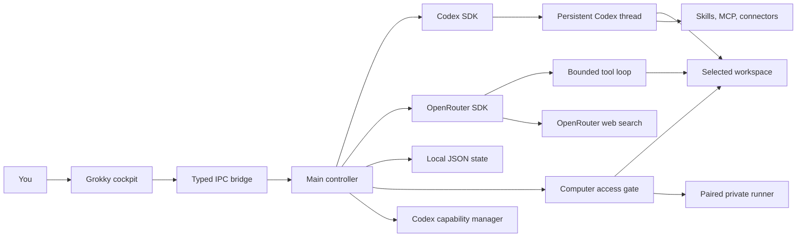
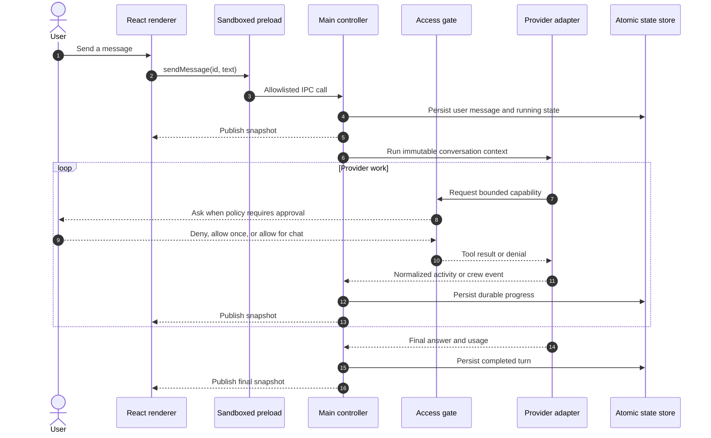
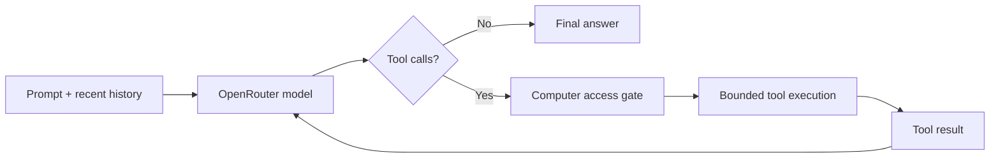
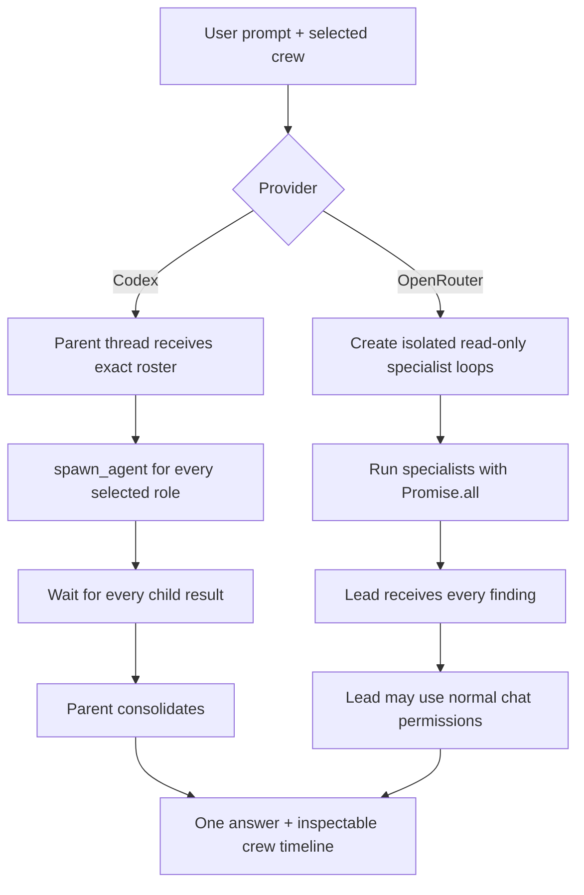

<p align="center">
  
</p>

<h1 align="center">Grokky</h1>

<p align="center">
  <strong>A local-first desktop cockpit for Codex, OpenRouter, and coordinated AI crews.</strong>
</p>

<p align="center">
  <a href="https://github.com/earlyaidopters/grokky/actions/workflows/verify.yml"></a>
  
  
  
  
  
  
</p>

Grokky turns a folder on your computer into a visual AI workspace. Pick the official Codex SDK or any compatible OpenRouter model, choose a crew, define the access boundary, and watch the work unfold as messages, tool activity, specialist handoffs, approvals, and usage.

The interface is only the cockpit. Credentials, model processes, files, commands, native permissions, and remote-computer tokens stay behind Electron's trusted main-process boundary.

> [!IMPORTANT]
> This repository is private and `UNLICENSED`. It contains no API keys, login sessions, local conversations, machine hostnames, screenshots with personal paths, or user-specific configuration.

## Start here

- **Just want the app?** Follow [Install a packaged build](#install-a-packaged-build).
- **Running it for the first time?** Use the [First-run checklist](#first-run-checklist).
- **Developing locally?** Follow [Development quick start](#development-quick-start).
- **Connecting a provider?** See [Codex SDK setup](#codex-sdk-setup) or [OpenRouter setup](#openrouter-setup).
- **Using multiple agents?** Read [Multi-agent orchestration](#multi-agent-orchestration).
- **Connecting another machine?** Read [Pair a private computer](#pair-a-private-computer).
- **Something is broken?** Jump to [Troubleshooting](#troubleshooting).

Current application version: **0.1.2**

## Version 0.1.2 highlights

- Project and access preflight keeps a request in the composer until the selected folder and permission can actually complete it.
- Codex crew cards show confirmed specialist state, a compact overview, and a chronological Messages tab for real lead-to-agent traffic.
- Activity groups raw runtime actions into readable phases while preserving commands and output inside disclosures.
- The application-wide design pass improves settings hierarchy, sidebar density, picker descriptions, light theme contrast, and compact-window layouts.
- macOS arm64 and Windows x64 packages are built from this same commit on native GitHub runners and verified for the matching bundled Codex executable.

## The product in one view



## Why this exists

Most AI desktop apps collapse three different concerns into one opaque chat box:

1. The model provider
2. The tools and permissions
3. The orchestration strategy

Grokky keeps them visible and independently configurable. A conversation records which provider, model, reasoning level, workspace, sandbox, command policy, and crew produced the result. The same React interface can drive a native Codex thread or an OpenRouter tool loop without pretending those runtimes work the same way.

## What is already built

| Area | Capability |
| --- | --- |
| Conversations | Create, search, switch, cancel, and delete local chats with a confirmation step |
| Providers | Switch between the official Codex SDK and OpenRouter per conversation |
| Models | Select Codex models, enter any valid OpenRouter model ID, and set reasoning effort |
| Projects | Search recent folders, choose or create a project from the composer, or use an isolated no-project scratch folder |
| Access | Switch each conversation between Read only, Workspace access, and Full access for local development commands |
| Live activity | Render reasoning, plans, files, commands, tools, errors, and usage as normalized events |
| Multi-agent | Run native Codex child threads or parallel OpenRouter specialists with a final lead |
| Agents | Create personal or project TOML agents with unique mascot colors, models, reasoning, and access |
| Skills | Discover and enable Codex skills from project, personal, system, and plugin roots |
| MCP | Inspect and toggle configured local or remote Codex MCP servers |
| Connectors | Inspect and toggle installed Codex connector plugins |
| Web | Use native Codex live search or OpenRouter's auditable server-side web search |
| Computer access | Gate files, commands, public web pages, and supported native controls |
| Remote computer | Pair a bounded runner over a private network, with encrypted bearer-token storage |
| Safety | Block credential files, path traversal, symlinks, private-network browser targets, and unsafe commands |
| Persistence | Atomically store sessions, settings, audit history, usage, and resumable Codex thread IDs |
| Appearance | System, dark, and light themes plus lime, electric blue, ultraviolet, amber, and ice accents |

## Provider capability matrix

The runtimes intentionally share a UI contract, not an implementation.

| Capability | Codex | OpenRouter |
| --- | :---: | :---: |
| Persistent conversation context | Native thread resume | Recent message history |
| Streaming activity | SDK thread events | Grokky tool-loop events |
| Multi-agent specialists | Native child threads | Parallel read-only model loops |
| Final coordinator | Codex parent thread | One lead model after specialists finish |
| Workspace tools | Codex sandbox and SDK tools | Grokky's bounded functions |
| Skills | Yes | Not yet |
| MCP servers | Yes | Not yet |
| Connector plugins | Yes | Not yet |
| Live web research | Codex live search | OpenRouter server web-search tool |
| Screen input | Native SDK feature when always allowed | Grokky screenshot tool with approval on macOS |
| UI automation | Native SDK feature when always allowed | Grokky native tools with approval on macOS |

## Request lifecycle



## Supported platforms

| Platform | Packaged build | Providers, crews, files, commands, and web | Native screen and app control |
| --- | --- | :---: | :---: |
| Apple Silicon macOS | DMG | Yes | Yes, with macOS permission |
| Windows x64 | NSIS installer | Yes | Not yet |

The renderer, providers, persistence, workspace tools, web research, agent orchestration, and remote runner are cross-platform. macOS Screen Recording and Accessibility integrations are intentionally unavailable on Windows. Linux is not currently a packaged or CI-supported target.

## Install a packaged build

Packaged users do not need Node.js or npm. They need access to this private repository and credentials for at least one provider.

1. Open the repository's [Verify workflow](https://github.com/earlyaidopters/grokky/actions/workflows/verify.yml).
2. Open the newest green run on `main`.
3. Download one artifact from the **Artifacts** section:
   - `Grokky-macOS-arm64`
   - `Grokky-Windows-x64`
4. Unzip the downloaded artifact.
5. Install the platform package below.

Workflow artifacts are retained for 14 days. If an older artifact has expired, use the newest successful run or push a new commit to produce fresh packages.

### macOS installation

1. Open `Grokky-<version>-mac-arm64.dmg`.
2. Copy `Grokky.app` into `/Applications`.
3. Launch Grokky from Applications.

### Windows installation

1. Run `Grokky-<version>-win-x64.exe`.
2. Choose the installation directory when prompted.
3. Launch Grokky from the Start menu or the selected directory.

> [!WARNING]
> Current packages are unsigned development builds. macOS Gatekeeper or Windows SmartScreen may warn before launch. Do not bypass an operating-system warning unless you trust the repository, the workflow run, and the exact commit that produced the artifact. Public distribution should use signed and notarized packages.

## First-run checklist

1. Install the [Codex CLI](https://learn.chatgpt.com/docs/codex/cli), run `codex`, and complete its sign-in flow; configure OpenRouter; or do both.
2. Create a session and choose the narrowest practical project from the composer menu.
3. Select **Read only** unless the task genuinely needs workspace writes.
4. Select **Full access** only when tests, builds, installs, or a local server are required.
5. Review **Computer access** and leave sensitive capabilities on **Ask** or **Blocked**.
6. Enable live web search when the task needs current information.
7. Optionally select a crew or create agents with distinct roles and mascots.
8. Send the outcome you want. Activity, approvals, specialist state, and reports appear in the conversation.

New installs start in **No project**, an isolated `~/.grokky/no-project` scratch folder. Project work is rejected before provider dispatch until a real folder is selected, and localhost or package-command work is rejected until **Full access** is selected. Grokky never treats the user's home directory as an implicit project root.

## Development quick start

### Prerequisites

- Apple Silicon macOS or Windows x64
- Node.js 20.19 or newer
- npm 10 or newer
- A saved Codex sign-in, an OpenRouter key, or both

### Install and run

```bash
git clone git@github.com:earlyaidopters/grokky.git
cd grokky
npm ci
npm run dev
```

### Verify everything reproducible

```bash
npm run verify
```

That command runs the privacy and repository-hygiene gate, TypeScript checks, the deterministic test suite, and a production renderer/main-process build.

Live provider checks are separate because they require existing credentials and may incur model usage:

```bash
npm run smoke:codex
npm run smoke:codex-provider
npm run smoke:codex-web
npm run smoke:multiagent
npm run smoke:openrouter
npm run smoke:openrouter-crew
npm run smoke:openrouter-web
npm run smoke:electron
```

## Codex SDK setup

Grokky uses the official [`@openai/codex-sdk`](https://www.npmjs.com/package/@openai/codex-sdk) in Electron's main process. The SDK controls a local Codex agent, keeps model execution out of the renderer, and supports starting, continuing, and resuming threads. See the [official Codex SDK guide](https://learn.chatgpt.com/docs/codex-sdk).

### 1. Sign in once

Install the [Codex CLI](https://learn.chatgpt.com/docs/codex/cli), open a terminal, and run:

```bash
codex
```

Complete the CLI's sign-in flow the first time it opens. Grokky checks the normal Codex auth location, or the location selected by `CODEX_HOME`. It does not copy session material into this repository or its conversation database.

### 2. Start or resume a thread

The provider creates one SDK client per run, applies Grokky's feature settings, then chooses the thread operation from the conversation state:

```ts
const codex = new Codex({ config });

const thread = conversation.threadId
  ? codex.resumeThread(conversation.threadId, options)
  : codex.startThread(options);

const { events } = await thread.runStreamed(prompt, { signal });
```

When the SDK emits `thread.started`, Grokky stores the thread ID. The next turn resumes the same thread with the active model, reasoning, workspace, sandbox, network, and search options.

### 3. Normalize SDK events

The provider maps SDK items into renderer-safe contracts:

| SDK event or item | Grokky representation |
| --- | --- |
| `thread.started` | Persisted thread ID |
| `reasoning` | Reasoning activity |
| `command_execution` | Command activity and output |
| `file_change` | File activity and changed paths |
| `mcp_tool_call` | Tool activity |
| `todo_list` | Plan activity |
| `web_search` | Web-search activity |
| `agent_message` | Coordinator update or final answer |
| `turn.completed` | Token usage |
| `collab_tool_call` | Legacy SDK collaboration state |
| Local `SubAgentActivity` and child `FINAL_ANSWER` records | Confirmed Sol child threads and reports when the public SDK omits them |

### 4. Package the native executable correctly

Electron archives application code inside `app.asar`, but a native executable cannot be spawned from that virtual path. The build unpacks the Codex platform package, and the provider resolves the real binary into `codexPathOverride` at runtime.

Full implementation notes: [docs/CODEX-SDK.md](docs/CODEX-SDK.md)

## OpenRouter setup

Grokky uses the official [`@openrouter/sdk`](https://www.npmjs.com/package/@openrouter/sdk) for typed chat calls and a direct OpenRouter request for the current server-side web-search tool.

### 1. Supply a key outside the renderer

Use any one of these sources, in priority order:

1. `OPENROUTER_API_KEY` in the launching process
2. An env file chosen in **Settings → Session → OpenRouter credential**
3. `GROKKY_OPENROUTER_ENV_FILE` pointing to an env file
4. `$HOME/.config/grokky/.env`

Example local file:

```dotenv
OPENROUTER_API_KEY=replace_with_your_key
```

Only the selected file path can be persisted. The key value is resolved in the main process for the request and never enters React, typed IPC, chat state, logs, or Git.

### Environment variables

| Variable | Purpose | Required |
| --- | --- | :---: |
| `OPENROUTER_API_KEY` | Supplies the OpenRouter key to the main process | No |
| `GROKKY_OPENROUTER_ENV_FILE` | Selects an env file containing `OPENROUTER_API_KEY` | No |
| `CODEX_HOME` | Uses a non-default Codex configuration and authentication directory | No |
| `GROKKY_USER_DATA_PATH` | Overrides Electron user data for isolated development or testing | No |
| `GROKKY_CODEX_SMOKE_MODEL` | Overrides the model used by Codex live smoke tests | No |
| `GROKKY_OPENROUTER_SMOKE_MODEL` | Overrides the model used by OpenRouter live smoke tests | No |
| `GROKKY_DEBUG_EVENTS=1` | Prints bounded provider events during development | No |

Do not commit local env files. The repository hygiene check rejects credential-shaped keys and private machine paths.

### 2. Run a bounded tool loop

The OpenRouter provider sends message history, reasoning effort, and only the tools allowed by the active conversation and computer policy. It executes returned calls through the same access gate, appends tool results, and repeats for at most eight steps.



The tool catalog can include file listing, literal search, file reads, exact edits, safe file creation, allowlisted development commands, public-page reads, and platform-supported native controls. The catalog shrinks automatically for read-only specialists and restricted devices.

### 3. Use auditable live web search

When web search is enabled and the prompt calls for current information, Grokky invokes OpenRouter's current server tool:

```json
{
  "type": "openrouter:web_search",
  "parameters": {
    "engine": "auto",
    "max_results": 5,
    "max_total_results": 10,
    "max_uses": 3,
    "search_context_size": "medium"
  }
}
```

The research step must return evidence that a server search ran plus source URLs. Grokky retries once if either is absent, records the sources in activity, and feeds the verified brief to the final answer. This follows OpenRouter's [server tools](https://openrouter.ai/docs/guides/features/server-tools/overview) and [web search](https://openrouter.ai/docs/guides/features/server-tools/web-search) documentation.

Full implementation notes: [docs/OPENROUTER.md](docs/OPENROUTER.md)

## Multi-agent orchestration

Selecting a crew is an execution contract, not a decorative prompt hint.



For Codex, Grokky enables the SDK's multi-agent features and translates confirmed collaboration evidence into named specialist cards plus an inspectable Messages tab. Legacy runtimes expose that evidence as SDK collaboration items. Sol's v2 protocol currently omits child starts and reports from the public stream, so Grokky tails only the active root thread's local Codex JSONL record and maps `SubAgentActivity` starts plus plaintext child `FINAL_ANSWER` payloads. It ignores encrypted intermediate content. The Messages tab shows confirmed assignments, direct messages, specialist reports, sender and receiver routing, timestamps, and exceptional delivery states in chronological speaker groups without exposing raw orchestration tool names. For OpenRouter, every specialist gets its own prompt, optional model, optional reasoning level, developer instructions, and read-only tool catalog. All specialists run concurrently. One lead runs only after they finish, owns any allowed writes, and produces the user-facing result.

Agent definitions live in normal Codex TOML locations:

- Personal: `$HOME/.codex/agents/*.toml`
- Project: `<workspace>/.codex/agents/*.toml`

Grokky adds a comment-only `grokky_icon` metadata field so the interface can assign a different mascot color without changing the agent contract.

## Skills, MCP servers, and connectors

The capability manager reads the active Codex configuration and presents three dedicated settings views:

- **Skills** discovers `SKILL.md` packages from the project tree, personal skill folders, system skills, and plugin caches.
- **MCP servers** discovers `[mcp_servers.*]` tables and preserves whether each server is local, remote, or otherwise configured.
- **Connectors** discovers `[plugins.*]` entries.

Toggles update only the relevant `enabled` field or skill config block in `$HOME/.codex/config.toml`. Writes are atomic and preserve unrelated configuration. These capabilities currently feed Codex runs. OpenRouter uses Grokky's built-in bounded tools and does not yet consume Codex skills, MCP servers, or connectors.

## Computer access model

Every sensitive tool maps to one of five capabilities:

| Capability | Examples | Default |
| --- | --- | --- |
| Files | List, search, read, create, edit | Always allow inside workspace |
| Commands | Tests, builds, inspection, safe Git commands | Ask |
| Browser | Read an approved public URL | Ask |
| Screen | Capture the current display | Ask |
| Automation | Open an app, click coordinates, type text | Ask |

Each capability can be **Blocked**, **Ask each time**, or **Always allow**. An approval can deny the request, allow that request once, or allow the capability for the current chat. Chat grants are memory-only and disappear when the app exits.

The browser tool rejects URLs with embedded credentials and any destination that resolves to loopback, link-local, RFC1918, carrier-grade NAT, or unique-local IPv6 space. Persistent web access also requires a domain allowlist.

Workspace file tools reject:

- Absolute paths and traversal outside the selected root
- Symlinks for file reads and edits
- Dependency, build, release, and Git internals
- `.env`, auth, credential, private-key, and certificate files
- Non-unique search and replace edits
- Arbitrary shell composition, network commands, deletion, and system control

Read the complete threat model and trust boundaries in [docs/SECURITY.md](docs/SECURITY.md).

## Pair a private computer

The included runner exposes only bounded workspace tools. It has no model credential, renderer, or access to Grokky's conversation database.

On the computer to control:

```bash
git clone git@github.com:earlyaidopters/grokky.git
cd grokky
npm ci
npm run runner -- \
  --root "/absolute/path/to/workspace" \
  --host "100.x.x.x" \
  --port 4747
```

The runner prints a one-time six-digit pairing code. In Grokky, open **Settings → Computer access**, enter the private endpoint and code, then select the device.

Add `--allow-write` only if the runner may accept workspace-write requests. Add `--allow-commands` only if it may accept the small command allowlist. Grokky's own conversation sandbox and capability policy still apply, creating two independent checks.

> [!WARNING]
> Bind the runner only to loopback or an authenticated private network such as Tailscale. The built-in runner speaks HTTP and relies on the private transport for encryption. Never expose it directly to the public internet.

## Persistence and chat deletion

Grokky stores state in Electron's per-user application-data directory. The default conversation file is:

```text
macOS:  $HOME/Library/Application Support/Grokky/conversations.json
Windows: %APPDATA%\Grokky\conversations.json
```

The file contains conversations, messages, activity summaries, settings, usage, Codex thread IDs, access policy, recent audit entries, and encrypted remote-runner tokens. Writes use a temporary file plus atomic rename and private filesystem permissions.

Deleting a chat from the sidebar or toolbar removes it from that local state and cancels an active run first. Deleting local metadata does not delete a provider's remote records, Codex home data, agent TOML files, or workspace files.

To back up Grokky, close the app and copy `conversations.json` to a protected location. Treat the backup as sensitive because it can contain prompts, responses, paths, audit records, and encrypted runner credentials. Removing the application does not automatically delete this per-user state.

## Updating

Grokky does not currently include an automatic updater. Download the newest artifact from the latest green `main` workflow run and replace or reinstall the application. Conversation state lives outside the application bundle, so an ordinary update preserves sessions and settings. Back up `conversations.json` before changing versions when the local history matters.

## Repository map

```text
grokky/
├── .github/workflows/verify.yml       macOS and Windows CI and package gate
├── build/icon-mascot.png              active application icon
├── docs/
│   ├── ARCHITECTURE.md                process, data, and orchestration design
│   ├── CODEX-SDK.md                   Codex integration guide
│   ├── DEVELOPMENT.md                 development and release workflow
│   ├── OPENROUTER.md                  OpenRouter integration guide
│   └── SECURITY.md                    threat model and privacy boundary
├── scripts/
│   ├── check-repository-hygiene.mjs   privacy and secret guard
│   └── smoke-*.mjs                    credential-gated integration checks
├── src/
│   ├── main/                          trusted Electron process and providers
│   ├── preload/                       minimal typed IPC bridge
│   ├── renderer/                      React interface and custom design system
│   └── shared/                        contracts and runtime validation
└── tests/                              deterministic and live integration tests
```

## Build and package

On Apple Silicon macOS, create an unpacked application:

```bash
npm run package:mac:dir
```

Create and verify a DMG on Apple Silicon macOS:

```bash
npm run package:mac
```

On Windows x64, create an unpacked application or a verified NSIS installer:

```powershell
npm run package:win:dir
npm run package:win
```

Artifacts are written under `release/` and are ignored by Git. Every push to `main` verifies and packages on native macOS arm64 and Windows x64 GitHub runners, checks that the correct Codex executable is present outside `app.asar`, and uploads both installers as workflow artifacts. Development packages are unsigned. External distribution requires the appropriate Apple Developer ID or Windows code-signing identity and a release-specific security review.

Package commands intentionally refuse to cross-build on the wrong operating system. Electron can produce a Windows shell on macOS, or a macOS shell on another host, while silently omitting the target-specific Codex executable. Native packaging plus the bundled-runtime check prevents an installer that launches but cannot run Codex.

### Package verification

After a local package build, verify that the platform Codex executable was unpacked correctly:

```bash
npm run verify:package:mac
```

```powershell
npm run verify:package:win
```

CI performs this inspection before uploading either installer. A package is not considered successful merely because Electron produced a DMG or EXE.

## Troubleshooting

### Codex shows “sign-in missing”

Run `codex` in a terminal and complete the sign-in flow, then refresh provider status in Grokky. If you use `CODEX_HOME`, confirm the app and CLI point to the same directory.

### OpenRouter shows “key missing”

Open **Settings → Session → OpenRouter credential** and choose a readable env file containing exactly one `OPENROUTER_API_KEY=...` entry. You can also launch Grokky with `OPENROUTER_API_KEY` or `GROKKY_OPENROUTER_ENV_FILE` set.

### Web research does not run

Confirm live web search is enabled for the session. Codex uses its native search capability. OpenRouter uses its server-side web-search tool and requires a valid OpenRouter key and a compatible model. Grokky records the search activity and source URLs when research runs.

### Skills, MCP servers, or connectors are missing

These settings reflect the active Codex home and workspace. Confirm `CODEX_HOME`, the selected workspace, and the relevant entries in the standard Codex configuration. They currently apply to Codex sessions only, not OpenRouter sessions.

### A Windows session cannot capture or click the screen

That is the current platform boundary. Windows supports providers, crews, files, bounded commands, public browsing, persistence, and the private runner. Native screen capture and UI automation are macOS-only.

### A packaged Codex turn fails to spawn

Install the artifact matching the operating system and CPU architecture. For local builds, run the matching `verify:package:*` command and confirm the native executable exists under `app.asar.unpacked`.

### A chat still appears after deletion

Use the sidebar or toolbar delete control and confirm the dialog. The app cancels an active run, removes the conversation from `conversations.json`, and selects another session. If the state file is not writable, inspect the per-user application-data directory and its permissions.

### No downloadable installer appears

Open the latest completed green `main` workflow run. Pull-request runs verify source but do not package. Installer artifacts are created only for pushes to `main` and expire after 14 days.

## Design principles

1. **The renderer is untrusted.** It cannot read credentials, import Node, spawn processes, or touch the filesystem directly.
2. **Provider behavior must be honest.** The UI distinguishes native Codex behavior from Grokky-owned OpenRouter orchestration.
3. **Delegation must be observable.** A crew is not shown as working until a real child or specialist run exists.
4. **Permission is layered.** Workspace mode, chat command setting, capability policy, native OS permission, and remote-runner flags all narrow access.
5. **State is local and inspectable.** Conversations are not hidden in a bundled cloud database.
6. **Brand carries function.** Mascot colors identify roles and live states, while the interface remains information-dense and calm.
7. **Generated output is not source.** Builds, captures, local state, and smoke screenshots stay outside version control.

## Documentation

- [Architecture](docs/ARCHITECTURE.md)
- [Codex SDK integration](docs/CODEX-SDK.md)
- [OpenRouter integration](docs/OPENROUTER.md)
- [Security and privacy](docs/SECURITY.md)
- [Development and release workflow](docs/DEVELOPMENT.md)
- [Contributing](CONTRIBUTING.md)

## Current boundaries

- Packaged targets are Apple Silicon macOS and Windows x64.
- Native screen and Accessibility automation are macOS-only.
- Codex skills, MCP servers, and connectors do not automatically become OpenRouter tools.
- The remote runner supports bounded file and command capabilities, not remote screen or UI automation.
- OpenRouter web research currently uses a dedicated research model constant before final synthesis.
- Packaged development builds are unsigned and not notarized.

## Independent implementation notice

Grokky is an independent application built against public SDKs and documented provider contracts. It does not include proprietary source code, assets, protocol definitions, internal packages, or installers from another commercial desktop agent. Product inspiration and behavioral research do not imply affiliation, endorsement, or compatibility certification.

## Ownership

Copyright © 2026 Early AI Dopters. All rights reserved.

This private repository is `UNLICENSED`. No permission to copy, redistribute, sublicense, or publish the source is granted outside the repository owner's explicit authorization.
