# Grokky architecture

This document describes the implementation that ships in this repository. It separates product behavior from provider-specific behavior so future work can extend one layer without weakening another.

## System context

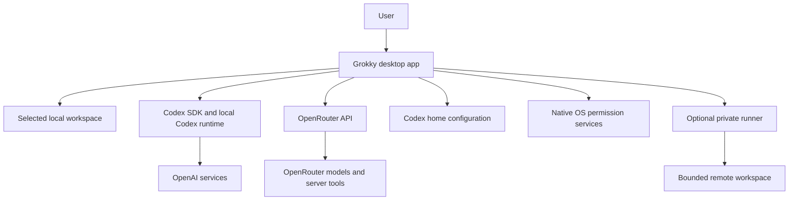

Grokky owns the desktop interface, local persistence, typed boundary, provider normalization, OpenRouter tool loop, access policy, and remote runner. Codex owns its native thread runtime, authentication, SDK tools, skills, MCP execution, connectors, and child-thread implementation. OpenRouter owns model routing and server-side tools.

## Electron trust boundary

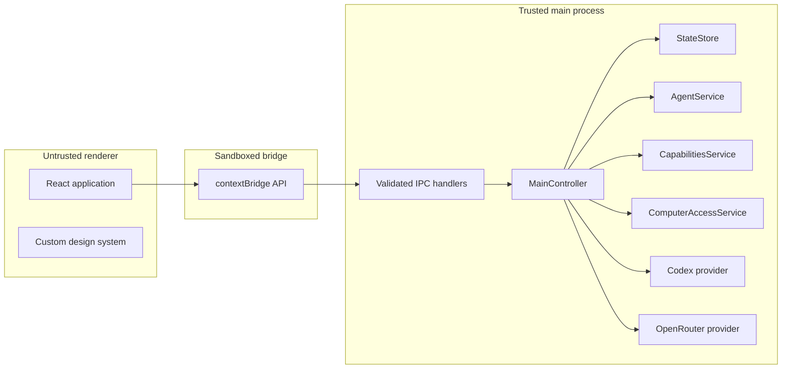

The renderer runs with:

- `contextIsolation: true`
- `nodeIntegration: false`
- `sandbox: true`
- A preload exposing only the `GrokkyApi` contract
- External navigation blocked and web links opened through a validated main-process handler

The renderer receives complete application snapshots. It never receives a provider key, runner bearer token, Codex auth record, unrestricted filesystem handle, shell handle, or Node primitive.

## Source ownership

| Layer | Primary files | Responsibility |
| --- | --- | --- |
| Shared contracts | `src/shared/contracts.ts` | Serializable domain types, provider IDs, IPC names, UI snapshots |
| Runtime validation | `src/shared/validation.ts` | Validate every renderer-controlled IPC payload |
| Preload | `src/preload/index.ts` | Convert the allowlisted API into `ipcRenderer.invoke` calls |
| Controller | `src/main/controller.ts` | Coordinate conversations, providers, tools, state, cancellation, and snapshots |
| Codex adapter | `src/main/providers/codex-provider.ts` | Configure SDK threads and normalize SDK events |
| OpenRouter adapter | `src/main/providers/openrouter-provider.ts` | Run chat, tools, web research, and crew synthesis |
| Access gate | `src/main/computer-access.ts` | Resolve policy, approvals, target device, browser safety, and audit |
| Workspace tools | `src/main/workspace-tools.ts` | Enforce path, file, edit, and command boundaries |
| Native host | `src/main/computer-host-electron.ts` | Screen capture, Accessibility actions, and encrypted token storage |
| Remote runner | `src/main/runner-service.ts` | Expose paired, bounded workspace tools on another computer |
| Capabilities | `src/main/capabilities.ts` | Discover and toggle Codex skills, MCP servers, and connectors |
| Agents | `src/main/agents.ts` | Discover, create, update, and delete Codex TOML agents |
| State | `src/main/state-store.ts` | Normalize, migrate, and atomically persist local state |
| Renderer | `src/renderer/src` | Present sessions, messages, activity, crews, settings, and approvals |

## Snapshot state model

The main process is authoritative. React does not optimistically own durable conversation state.

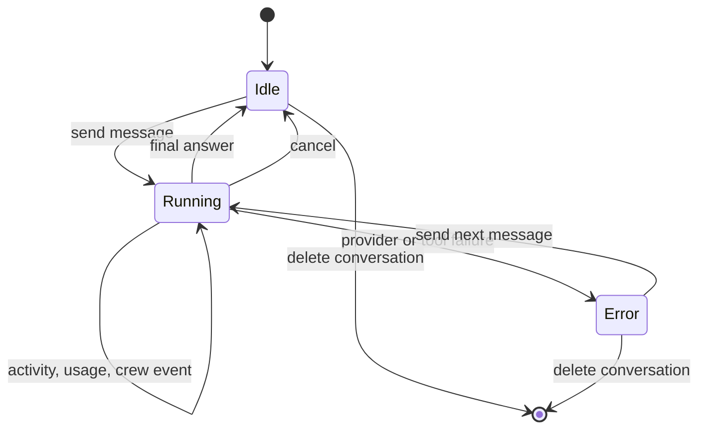

Every meaningful mutation follows the same pattern:

1. Validate the request in IPC or the controller.
2. Mutate main-process state.
3. Queue an atomic state save when the change is durable.
4. Publish a full `AppSnapshot` to the renderer.
5. Let React derive view state from the new snapshot.

This avoids partial renderer state when multiple SDK events arrive quickly.

## One conversation turn

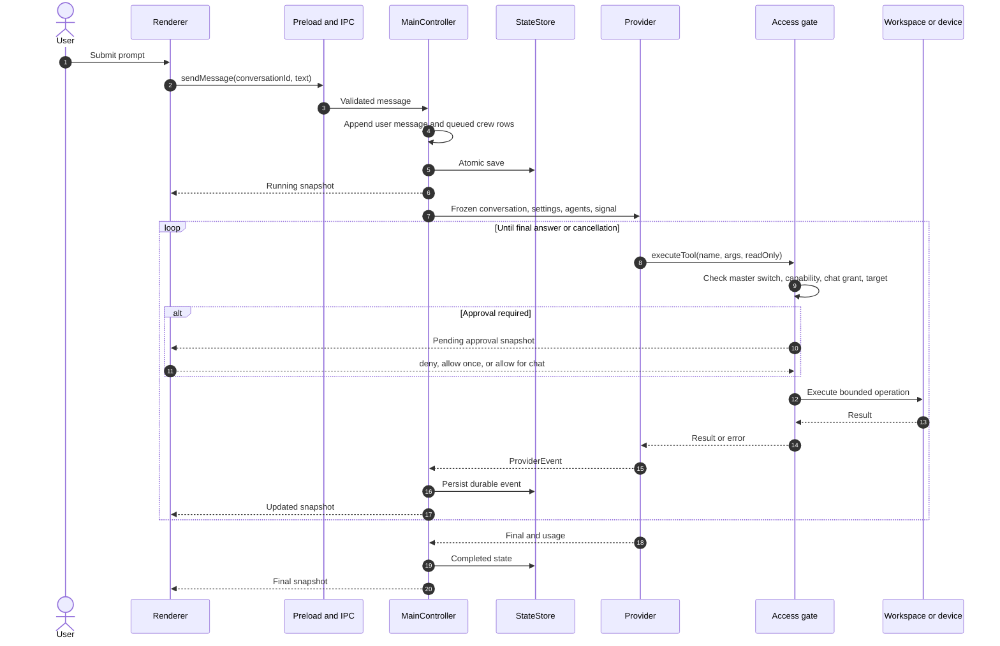

## Provider adapter contract

Both adapters receive a `ProviderRunContext` or `OpenRouterRunContext` containing:

- An immutable conversation snapshot
- An immutable settings snapshot
- Resolved selected agent definitions
- The current prompt
- An `AbortSignal`
- A computer-access snapshot
- A trusted `executeTool` callback
- An `onEvent` callback
- The OpenRouter API key only for the OpenRouter adapter

Both adapters emit a small union:

- Thread ID
- Activity item
- Orchestration event
- Final message
- Usage summary

The UI therefore renders one activity language even when the underlying provider protocols differ.

## Codex runtime

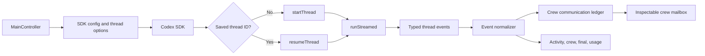

Codex options are derived per conversation. They include working directory, model, reasoning, sandbox mode, network access, web search, and cancellation. Feature configuration is derived per application setting. It includes multi-agent limits, subagent defaults, connectors, browser use, computer use, skills, and workspace dependency discovery.

The SDK receives a precise crew contract when agents are selected. Grokky observes real collaboration items and does not invent child state from assistant prose. Assignments and reports are retained as sender-to-receiver records, which lets the renderer show actual lead and specialist traffic instead of a generic loading state.

See [CODEX-SDK.md](CODEX-SDK.md).

## OpenRouter runtime

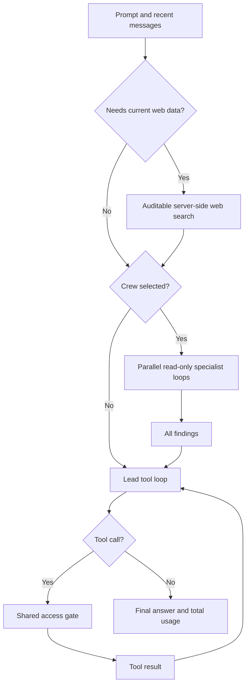

The tool loop caps the number of model rounds, runs one tool call at a time, catches tool errors as model-visible results, and aggregates usage across web research, specialists, and the lead. Specialist tools are always read-only. The lead gets only the capabilities allowed by the conversation and selected device.

See [OPENROUTER.md](OPENROUTER.md).

## Crew state normalization

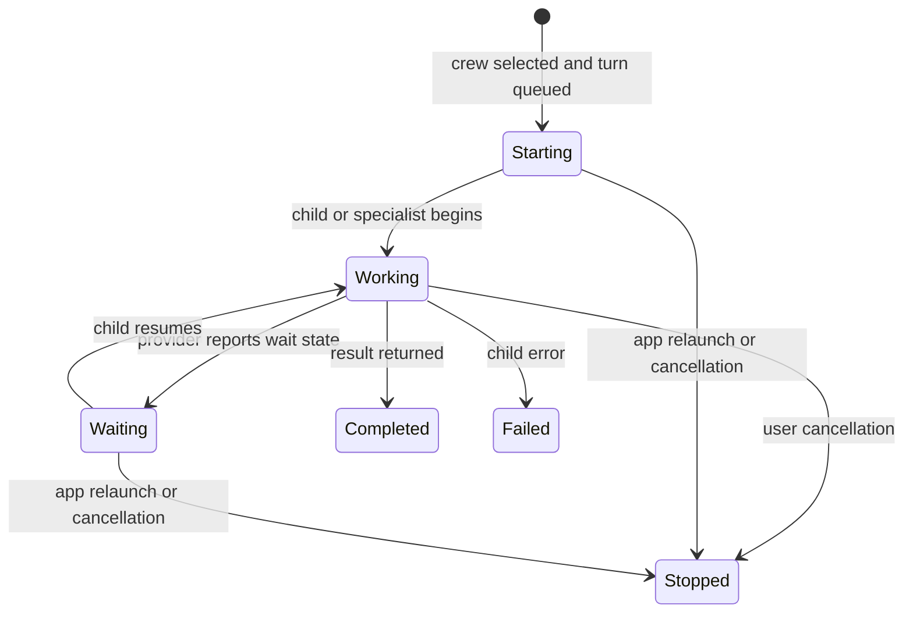

Agent rows persist their name, icon, bounded task, provider operation ID, thread ID, status, result, and timestamps. On launch, stale active states normalize to `stopped`. Completed specialist results remain inspectable with the conversation.

## Permission evaluation

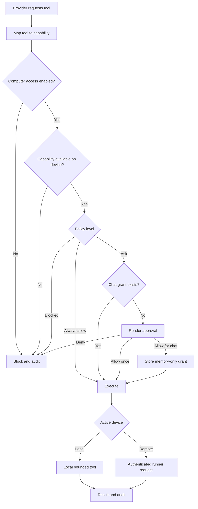

The final effective permission is the intersection of:

1. Global computer-access master switch
2. Capability availability on the selected device
3. Persistent capability policy
4. Optional memory-only chat grant
5. Conversation sandbox mode
6. Conversation command toggle
7. Provider-specific read-only restriction
8. Native operating-system permission when a supported screen or automation tool needs it
9. Remote runner startup flags

No single UI toggle can widen all layers.

## Private runner protocol

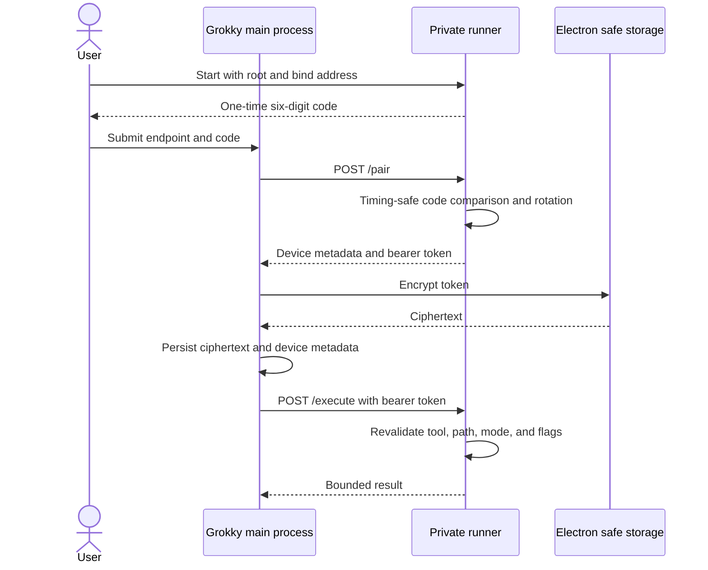

Runner endpoints:

| Endpoint | Authentication | Purpose |
| --- | --- | --- |
| `GET /health` | None | Report runner metadata and capabilities |
| `POST /pair` | Six-digit one-time code | Return the persistent bearer token and rotate the code |
| `POST /test` | Bearer token | Test file or command capability |
| `POST /execute` | Bearer token | Run one bounded workspace operation |

The runner's disk state uses mode `0600`. Grokky stores only an Electron `safeStorage` encrypted form of the bearer token. HTTP transport is designed for loopback or an encrypted private overlay network, not direct public exposure.

## Skills, MCP, connectors, and agents

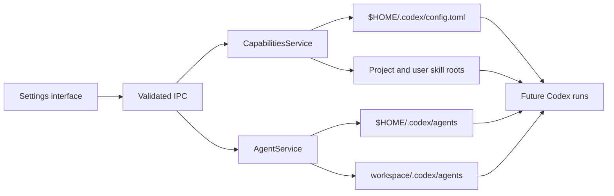

Capability and agent writes are atomic. The settings layer edits only direct supported configuration blocks and preserves unrelated Codex configuration. Built-in agents cannot be overwritten or deleted; they can be duplicated into a user-owned definition.

## Persistence model

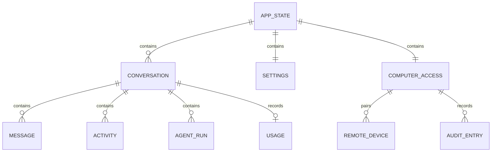

Persisted state intentionally includes user content and may be sensitive, but it lives outside the repository under Electron's per-user data directory. It is written with mode `0600` through a `.next` file followed by rename.

Grokky does not persist:

- The OpenRouter key value
- Codex authentication contents
- Decrypted remote-runner tokens
- Memory-only chat approvals
- Screen captures in conversation state
- Provider objects, processes, or abort controllers

## Cancellation and deletion

A live run owns an `AbortController` stored by conversation ID. Cancelling aborts the provider request, resolves outstanding computer approvals as denied, marks active crew rows stopped, and returns the conversation to idle. Deleting a conversation performs cancellation first, removes its in-memory run references, updates the active conversation, and atomically saves the new state.

## Extension points

The cleanest future seams are:

- Add a provider behind the normalized `ProviderEvent` contract.
- Add a local or remote tool behind `ComputerToolName`, capability mapping, and access audit.
- Add persistence migrations in `StateStore.load` without exposing raw disk data to React.
- Add OpenRouter MCP or connector support by converting external tool definitions into the bounded tool-loop contract.
- Add remote screen or automation only after the runner has a transport, permission, and image-security design appropriate for it.

## Independent implementation boundary

This source was implemented against public SDKs, public API documentation, and observable product behavior. It does not import another commercial application's proprietary source, private protocols, internal packages, or brand assets. Do not describe the project as an official client or as an authenticated reproduction of another product's internals.
