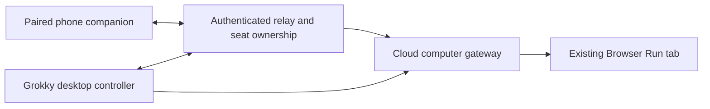

# Cloud computer and phone handoff review

Reviewed September 8, 2026 against `76e35393b2b86519b29dc1beb3a77dc887d50a4b`.

> This is the pre-implementation review. Version 0.1.4 implements the initial handoff; see [Phone control](PHONE-CONTROL.md) for the shipped behavior, verification and remaining work.

## Verification

| Check | Result | Boundary |
| --- | --- | --- |
| Installed application | Stale August 31 bundle, version 0.1.3 | The installed main bundle lacks `tickRoutines`, `recordRoutineFailure`, and `McpRuntime`; the current source build contains all three. |
| Source verification | 169 tests passed; six live tests skipped; hygiene, typecheck, build passed | Deterministic tests, including routine scheduling/failures and a real local MCP stdio echo server. |
| Desktop UI | All 51 Electron smoke cases passed | Includes routines, attention, quick setup, structured views, MCP settings, approvals, and responsive Watch. |
| Gateway | 26 tests and typecheck passed | Deployment dry build and a new deployment were not performed. |
| Installed cloud travel canary | Passed; 30 tool actions, harness reports 31 checks | Authenticated existing deployment, dedicated disposable seat, scripted actions rather than live model judgment. |
| Google Flights | Montreal to Istanbul; December 13–20, 2026; results evidenced | Does not establish business-class selection, outbound/return itinerary traversal, price quality, or a real model's ability to choose the next action. |

The cloud check also exercised files, edits, search, non-root commands, browser form filling, state preservation, expired-reference rejection, PNG integrity, signed Live View URL shape, and confirmed seat disposal. It did not visually interact with the Live View stream on a physical phone. Normal desktop sessions and configuration were not changed.

Installed main bundle SHA-256: `65c1a3b453bea8e7adc5a79062d1a93872fbb27fb81e4e960548748b22aff365`.

Current locally built main bundle SHA-256: `a03d727013a5fb4b9c3ac78c3234b7fc79dc951b7ab32c3e2ab9c82db298a1b1`.

Both builds use 0.1.3. Future packaging should expose the commit and build date, and bump the app version when its behavior changes. This review does not install a new bundle.

## Cloud computer improvements, in priority order

### 1. Bound images sent back to the model

`src/main/providers/openrouter-provider.ts` attaches high-detail PNGs to visual tool results and resends the accumulated `messages` array on every model turn. Old screenshots therefore continue travelling in later requests. This is a code observation, not a measured latency or billing claim.

Keep the latest two computer frames in model context as an initial experiment. Preserve user-supplied images, textual observations, call/result pairing, and all original evidence files in History. A user asking to compare older visual evidence needs an explicit retrieval path before adopting this as a universal default. Measure payload bytes, input/image tokens, time to first action, action latency, and task success against the current behavior. Test both long browser sequences and historical screenshot comparisons.

### 2. Use the observation already returned by an action

Gateway actions already produce semantic observations plus a frame. The `inspect_page` tool description nevertheless tells the model to inspect after navigation. Change that guidance to use returned current references first and inspect only for missing, truncated, stale, or changed state. Prefer semantic fields and date controls to multi-action focus/select/type sequences. Keep the evidence gate.

Do not simply batch raw element references across changing pages: Grokky intentionally expires them after a new observation. Any bounded multi-action primitive must resolve targets afresh, validate each transition, retain per-action receipts, and stop at ambiguity.

### 3. Turn repeated failure into a resumable handoff

The provider currently appends recovery instructions after no-effect actions. It has no durable human-control pause. `ask_user` records an attention item; the turn ends and `executeRun` disposes the computer seats in `finally`. A person opening a link later could find the browser gone.

Add durable waiting state, a finite browser retention deadline, and an explicit owner for the seat. Preserve the browser while waiting. On resume, invalidate old references and queued model actions, acquire a fresh observation, and check the requested outcome. A human pressing Done is evidence that they finished intervening, not proof that the whole task succeeded.

### 4. Make Watch follow the correct tab

`services/sandbox-gateway/src/sandbox.ts` caches Live View by browser session, although the URL is created for a specific target. A popup or tab change can leave Watch pointing at the old tab. Key the cache by session and target identity, and regression-test tab open/close and two tabs with the same URL. This is a source-level risk; this review did not reproduce it live.

### 5. Measure before increasing budgets

Collect per-seat durations for acquire/connect, semantic action, settling, observation, screenshot, gateway transport, and model inference. Record action count, recovery count, observed outcome, bytes and provider usage without logging credentials or signed URLs. Benchmark a deterministic form, Google Flights dates/results, outbound-to-return traversal, a popup, a blocked action, and a takeover/resume sequence.

## Proposed phone experience

One mobile web companion, reachable after pairing it with the desktop:

1. **Watch:** active tasks and the latest frame, with a short activity line.
2. **Needs you:** the exact approval, missing choice, or browser intervention. Show the site and intended action. Approvals default to the individual pending action.
3. **Take control:** Grokky finishes or settles the in-flight action, acknowledges the pause, then gives the phone control of the same browser tab. Display a persistent "You are in control" state.
4. **Return to Grokky:** optionally add a short instruction. Grokky captures fresh state and continues from the page the person left open.
5. **Stop:** stops the run and closes the retained seat. Connection loss shows disconnected state and leaves automation paused until an explicit resume or timeout policy applies.

Use a focused touch layout: one active task, one dominant browser surface, and a bottom control area. Start with a full-screen hosted tab view as the compatibility baseline; verify an embedded view, touch targeting, scrolling, keyboard, and rotation on iOS Safari and Android Chrome before choosing the final presentation. The accompanying in-conversation mockup illustrates the control states only; it is not connected to an actual browser or phone.

## Architecture

Keep provider credentials in the existing desktop main process. The desktop initiates an outbound connection to a relay; the phone does not need an exposed local port. A separate Durable Object per pairing/session can coordinate commands and ownership with hibernating WebSockets. Do not attach a long-running command relay to the browser's active CDP connection and assume it can hibernate.

The first release requires the desktop to stay awake and connected. Routines and model orchestration currently live in Electron. Fully independent operation while the Mac is asleep requires moving those runtimes, credentials, persistence, approvals, and recovery into a cloud execution service. Treat that as a separate phase.

### Ownership and resumption contract

`agent_running → pause_requested → human_control → reobserving → agent_running`

Every transition carries a seat ID, run ID, monotonic control epoch, expiry, and idempotency key. Pause must be acknowledged after any current action settles; the phone cannot start sending input while an agent action is in flight. The gateway rejects stale-epoch agent input. Resumption cancels old planned tool calls and re-observes. A timeout or lost connection must not silently hand control back in the middle of human input.

Pair with a single-use expiring code or QR exchange, confirm the phone on desktop, then issue revocable device/session credentials. Keep signed Browser Run URLs out of durable state, chat, telemetry, and shareable reports. Log the handoff boundary and outcome; do not record human passwords or keystrokes. Suspend model screenshots/observations during sensitive human entry, then resume observation only after the human has finished.

### Cloudflare support and a material unresolved point

Cloudflare documents structured browser handoff: a tab Live View, `Cloudflare.handoff`, completion events, and handoff-state queries. Grokky currently uses tab Live View but none of those handoff primitives. Reuse that capability rather than implement an entire streaming desktop. [Human in the Loop](https://developers.cloudflare.com/browser-run/features/human-in-the-loop/)

Live View URL expiry limits starting a connection; Cloudflare says an already established connection can remain active while the browser lives. A short link expiry therefore does not prove input revocation. Verify that the handoff completion path actually disables all prior human input connections before returning agent ownership. If it does not, use a mediated input channel whose control epoch the gateway enforces. Do not ship simultaneous uncoordinated agent and human input. The vendor feature is labelled beta; a physical-phone compatibility test remains required. [Live View](https://developers.cloudflare.com/browser-run/features/live-view/)

Hibernating Durable Object WebSockets are a suitable candidate for the companion relay, avoiding active duration charges during idle periods subject to the documented hibernation requirements. [WebSocket guidance](https://developers.cloudflare.com/durable-objects/best-practices/websockets/)

## Smallest useful implementation sequence

1. Package/install the verified current source with distinguishable build identity. Preserve the previous bundle for rollback.
2. Add browser/model timing and payload measurements; test bounded frame context and observation reuse.
3. Implement and test pause/ownership/resume on desktop before adding remote access. Preserve seats while a handoff is pending.
4. Add pairing and the phone companion: watch, exact-action approval, take over, return, stop. Prove stale clients cannot control the resumed browser.
5. Test physical-phone keyboard, touch, rotation, background/reconnect, duplicated commands, expired pairing, simultaneous takeovers, desktop sleep, and cancellation during an action.
6. Add notifications and independent cloud execution only after the core handoff is reliable.

No public deployment, phone pairing, notification delivery, repository issue creation, or implementation of these proposals occurred in this review.
