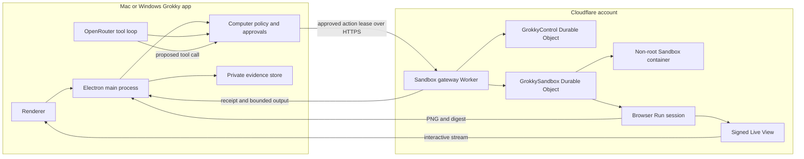
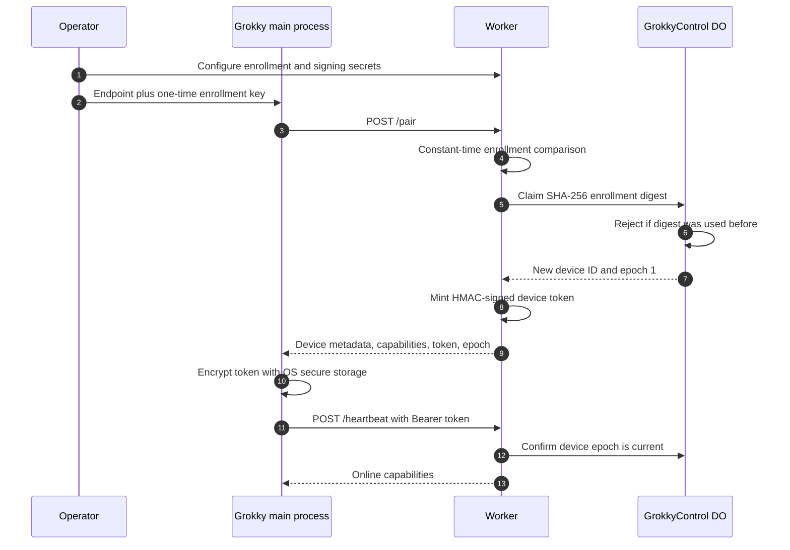
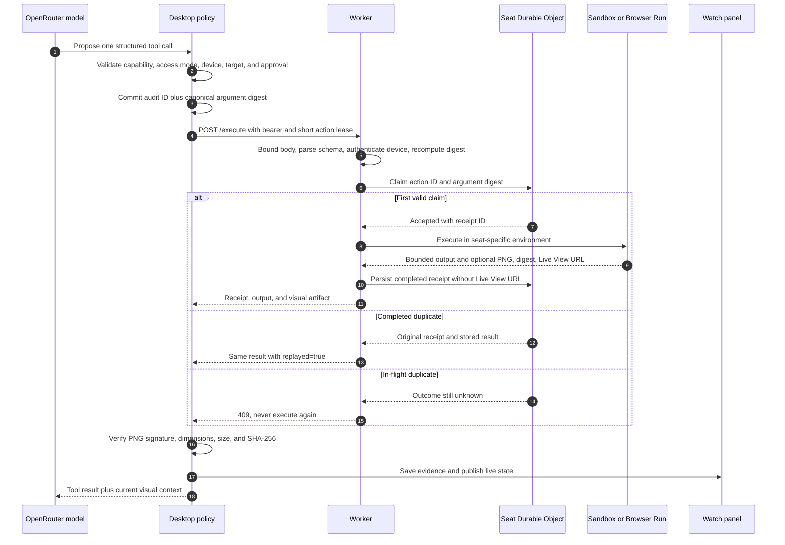

# Cloudflare computer deployment and operations

Research lock: 2026-08-29

This is the authoritative runbook for Grokky's disposable OpenRouter computer. It explains what the system is, which Cloudflare products it uses, how an action travels through the system, how to deploy it, how to pair it on macOS and Windows, how to operate it safely, and how to troubleshoot it.

The short version is simple: Grokky does not send OpenRouter a reusable cloud credential. Electron approves and precommits one bounded action, the Worker validates it, a Durable Object claims it, and a seat-specific Cloudflare Sandbox or Browser Run session executes it. The result returns with a receipt and, for browser actions, integrity-checked visual evidence plus a short-lived live browser view.

## Product boundary

The current computer provides:

- A separate Linux `/workspace` for each active OpenRouter agent seat
- Structured file listing, literal search, text reads, exact edits, and safe file creation
- Shell commands only when the conversation is explicitly set to Full access
- A reusable isolated Chromium session for public web navigation
- Browser-scoped clicks and typing inside a fixed 1280 by 800 viewport
- A signed interactive Browser Run Live View for the active session
- Saved PNG evidence after browser actions, with SHA-256 verification in Electron
- Explicit teardown plus idle expiry as a fallback

It is not:

- A copy of the user's Mac or Windows desktop
- A general Linux GUI or remote desktop
- A browser with the user's personal cookies or logged-in sessions
- A synchronized copy of the selected local project
- A place where OpenRouter, Codex, or runner credentials are injected

The cloud `/workspace` is independent. If a model creates a file there, Grokky must not claim that the local project changed. Controlled project synchronization is future work.

## Cloudflare components

| Component | Configuration in this repository | Why Grokky uses it |
| --- | --- | --- |
| Workers | `services/sandbox-gateway/src/index.ts` | HTTPS control plane, request validation, authentication, routing, and response shaping |
| Durable Objects | `GrokkyControl` and `GrokkySandbox` | Strongly consistent enrollment, revocation epochs, action claims, replay receipts, and browser-session metadata |
| Durable Object SQLite | Declared by the `v1` migration | Durable one-time enrollment and action receipt ledgers outside model-controlled storage |
| Sandbox SDK | `@cloudflare/sandbox` pinned in `package.json` | Isolated command and file execution inside Cloudflare Containers |
| Containers | `GrokkySandbox`, `lite`, maximum 8 | One disposable non-root `/workspace` execution environment per active seat |
| Browser Run | `BROWSER` binding | Isolated Chromium, Playwright control, screenshots, and live browser viewing |
| Browser Run Live View | `Cloudflare.getLiveView` over CDP | Short-lived signed interactive view at `live.browser.run` |
| Workers Observability | Logs at 100 percent, traces sampled at 5 percent | Request failures, deployment diagnosis, and operational visibility |

The current version does not use D1, KV, R2, Queues, Workflows, Workers AI, AI Gateway, Access, or a Cloudflare Tunnel. Durable Object SQLite is sufficient for the small control and receipt ledgers. Model traffic goes from Electron to OpenRouter; it does not pass through the gateway.

## Architecture



## Trust zones and stored data

| Location | Data stored there | Data deliberately absent |
| --- | --- | --- |
| Electron renderer | Renderer-safe application snapshot and active Watch URL | Provider keys, device token, Worker secrets, Node handles |
| Electron main process | OpenRouter key, encrypted paired-device token, active signed Live View URL in memory | Worker enrollment and signing secrets |
| Application data | Conversations, audits, seat history, verified PNG evidence, encrypted paired-device token | Plaintext remote token, Worker secrets |
| `GrokkyControl` Durable Object | Used enrollment digests, device IDs, token epochs, revocation state | Enrollment plaintext, provider credentials, conversations |
| `GrokkySandbox` Durable Object | Action IDs, argument digests, receipt IDs, bounded outputs, saved browser artifact metadata, browser session metadata | Live View URL, provider credentials, local files |
| Sandbox container | Seat-specific `/workspace` and command processes | Grokky state, local project, provider key, device token, Worker bindings |
| Browser Run | Empty isolated browser state for the seat | Personal browser cookies and local desktop state |

Electron uses the operating system's secure storage for the paired device credential. On macOS this is backed by Keychain. On Windows it is backed by the operating system credential protection available through Electron `safeStorage`. Conversation state never contains the plaintext token. It does persist the public token epoch alongside the encrypted credential so a revoke after an application restart still advances from the server-issued epoch instead of guessing from zero.

The Live View URL is treated as a credential. The gateway requests it for at most one hour, validates that it is HTTPS on the exact `live.browser.run` host with a `/ui/` path, returns it only with an active browser action, and omits it from the Durable Object receipt. Electron repeats the host and path validation, keeps the URL only in memory, uses a no-referrer embed, and clears it when the seat ends.

## Source map

| File | Responsibility |
| --- | --- |
| `services/sandbox-gateway/wrangler.jsonc` | Worker name, bindings, compatibility date, observability, container, and Durable Object migration |
| `services/sandbox-gateway/Dockerfile` | Pinned Sandbox base image and non-root `/workspace` |
| `services/sandbox-gateway/src/index.ts` | HTTP routes, bounded request reader, authentication, execution dispatch, and response limits |
| `services/sandbox-gateway/src/control.ts` | One-time enrollment, device registry, epochs, and revocation |
| `services/sandbox-gateway/src/protocol.ts` | Canonical digests, signed device tokens, request schemas, path rules, and URL boundary |
| `services/sandbox-gateway/src/sandbox.ts` | Action receipt ledger, container lifecycle, Browser Run, network interception, screenshots, and Live View |
| `services/sandbox-gateway/scripts/smoke-local.mjs` | Real local Worker, Durable Object, Sandbox-container, and browser-state protocol test, including replay, expiry, revocation, path escape, state continuity, and teardown |
| `src/main/computer-access.ts` | Desktop pairing, token storage, heartbeat, policy, action leases, remote calls, and artifact validation |
| `src/main/agent-computer.ts` | Per-agent seat lifecycle, attribution, action history, and evidence contract |
| `src/main/agent-computer-electron.ts` | Private browser profiles, evidence storage, hashing, and cleanup |
| `src/main/controller.ts` | Run ownership, seat assignment, teardown, live state, and persistence |
| `src/main/cloud-device-smoke.ts` | Credential-aware production gateway proof that runs inside an installed Grokky build so OS secure storage is exercised honestly |
| `src/main/providers/openrouter-provider.ts` | Bounded model tool loop and computer tool descriptions |
| `src/renderer/src/App.tsx` | Watch panel, Live and History modes, zoom, fit, full screen, resizing, and approval UI |
| `scripts/smoke-cloud-device.mjs` | Cross-platform launcher for the installed-app production gateway proof |
| `scripts/rotate-cloud-enrollment.mjs` | Secret-safe Wrangler rotation helper that can optionally create a mode-600 one-use test env outside the repository |
| `tests/openrouter-computer.integration.test.ts` | Opt-in real OpenRouter judgment test against the production gateway, including model-chosen visual actions and evidence validation |

## Enrollment sequence

Enrollment converts one high-entropy, one-time bootstrap value into a revocable device credential.



The raw enrollment key is not stored in Durable Object SQLite. Only its SHA-256 digest is recorded after successful use. Reusing the same key fails even if the configured Worker secret has not yet been rotated.

The signed device token contains only a version, device ID, epoch, and issued-at timestamp. Every authenticated request checks the signature and then asks the device-specific control object whether that epoch is still current. Revocation advances the epoch and immediately makes the prior token stale.

## Action sequence



Each lease is bound to:

- Device identity
- Conversation ID
- Agent-computer seat ID
- Action ID
- Canonical SHA-256 digest of the arguments
- Expiry

The normal desktop lease is two minutes. The gateway accepts only safe clock skew and refuses leases beyond five minutes. A duplicate action ID with different arguments is an error. An in-flight duplicate is reported as inconclusive because silently retrying a side effect would be unsafe.

## Browser sequence and live viewing

1. The desktop negotiates protocol version `2` from the authenticated device heartbeat, then authorizes the applicable legacy or semantic action. Semantic actions are `inspect_page`, `click_element`, `fill_field`, `press_key`, `select_option`, `scroll_page`, and `wait_for`; legacy navigation, screen, coordinate, and text actions remain available for visual recovery and older seats.
2. The gateway validates the URL, coordinate, text length, key, wait condition, select value, or observation-scoped element reference. A semantic reference expires as soon as a new observation is created.
3. The seat Durable Object holds its Playwright connection for the action sequence. If the isolate restarts, it reconnects to the stored Browser Run session; otherwise it acquires a new session with ten minutes of keep-alive.
4. Playwright fixes the viewport to 1280 by 800 and installs a request route before navigation.
5. The route blocks credential-bearing URLs, private and local literal addresses, and unauthorized top-level host changes.
6. The connection remains open between sequential model actions so the active tab, focus, typed form state, and cookies continue for the run. Calling `browser.close()` after an action is forbidden because it discards that live state.
7. The gateway extracts a bounded accessibility-style observation and classifies the action effect from before/after fingerprints and page changes. Visible controls include semantic roles, names, state, bounds, date hints, and scrollability; hidden or off-viewport controls are excluded.
8. The gateway takes a viewport PNG, computes its SHA-256, and requests a signed Live View URL over the Cloudflare DevTools Protocol. Electron independently validates the structured result and PNG, exposes the frame as History, and shows the signed page as Live.
9. Fit, 100 to 300 percent zoom, scroll-to-pan, panel resizing, and full screen operate in the renderer. Browser input in Live View is interactive and the next tool action still produces an audited saved frame.
10. Run completion, cancellation, conversation deletion, or explicit device disposal closes Browser Run and destroys the command container. Browser inactivity and the five-minute container idle sleep are fallbacks.

Live View does not exist before the first successful browser action. The saved History frames remain available after the signed Live URL expires.

## Prerequisites

For app users:

- Grokky on Apple Silicon macOS or Windows x64
- An OpenRouter API key saved through Grokky Settings
- The deployed gateway HTTPS URL
- A fresh one-time enrollment key

For gateway operators:

- A Cloudflare account with a Workers Paid plan
- Access to Cloudflare Workers, Durable Objects, Containers, Sandbox SDK, and Browser Run
- Node.js 20.19 or newer and npm 10 or newer
- Wrangler authentication for the target Cloudflare account
- Docker when building the custom Sandbox image locally or during deployment

Cloudflare limits and pricing can change. Review the current [Sandbox platform limits](https://developers.cloudflare.com/sandbox/platform/limits/), [Browser Run limits](https://developers.cloudflare.com/browser-rendering/platform/limits/), and [Containers pricing](https://developers.cloudflare.com/containers/pricing/) before production use. The repository caps concurrent container instances at eight, but account and product limits may be lower or impose additional usage controls.

## First deployment

Run these commands from the repository root. Secret values are entered interactively by Wrangler and must never be written into tracked files, issue comments, chat messages, or CI logs.

```bash
cd services/sandbox-gateway
npm ci
npm run verify
npx wrangler login
npx wrangler whoami
docker info
npm run secrets:new
npx wrangler secret put GROKKY_ENROLLMENT_TOKEN
npx wrangler secret put GROKKY_TOKEN_SECRET
npm run deploy
```

`npm run secrets:new` prints two independent values:

- `GROKKY_ENROLLMENT_TOKEN`: starts with `gsk_` and is used once to pair one installation
- `GROKKY_TOKEN_SECRET`: independently signs all device tokens and stays only in the Worker secret binding

Paste each value only into its matching Wrangler prompt. Save the one-time enrollment key temporarily in an approved secret manager so it can be entered into Grokky. Keep the signing secret in the Cloudflare secret binding. Never reuse an OpenRouter key, Codex credential, local runner token, or the same random value for both bindings.

`wrangler deploy` builds the Dockerfile, publishes the Worker and Durable Object migration, and begins the container rollout. A Worker script update and its container image rollout are not transactional. The first deployment can take several minutes. Retain the previous known-good deployment until the new container image is healthy.

Wrangler prints the deployed `https://...workers.dev` endpoint. Save only the endpoint, not its query string or a Live View URL.

### Verify the endpoint

```bash
curl --fail --silent --show-error https://YOUR-WORKER.workers.dev/health
```

Expected properties include:

```json
{
  "ok": true,
  "service": "grokky-sandbox-gateway",
  "isolation": "disposable-container",
  "capabilities": ["files", "commands", "browser", "screen", "automation"]
}
```

The health route does not provision a container and does not require a bearer token. It intentionally returns no secret or device metadata.

## Pair Grokky

On macOS or Windows:

1. Open Grokky.
2. Open Settings.
3. Select Computer access.
4. Under **Connected computers**, select **Pair**.
5. Enter the deployed HTTPS Worker URL in **Runner endpoint**.
6. Enter the fresh `gsk_…` enrollment key in **Pairing secret**. Do not enter the Worker signing secret.
7. Select **Pair securely**.
8. Select **Grokky Cloud Sandbox** as the active computer and confirm it is online.
9. Enable the needed capabilities under **Capability policy**, then use each relevant row's **Test** button. Tests can provision billable resources.
10. Confirm files, commands, browser, screen, and automation are available as needed. Send the [README browser check](../README.md#cloud-browser-on-macos-or-windows) to verify the model, approvals, actions and evidence together.

After successful pairing, rotate `GROKKY_ENROLLMENT_TOKEN` to a new unused value or remove access to the temporary plaintext copy. A used digest cannot enroll again, but rotating the configured secret prevents unnecessary reuse attempts and prepares the next controlled enrollment.

The desktop sends an authenticated heartbeat every 30 seconds. A paired device with no successful heartbeat for 90 seconds is shown offline and is not scheduled for new OpenRouter work.

## Test the complete computer

Create an OpenRouter session, select the cloud computer, set Full access, and send this safe proof prompt:

```text
Use your cloud computer to open https://www.cloudflare.com/. Tell me the page title, click no links, and capture the screen. Then run printf 'Grokky cloud command works\n' > grokky-proof.txt && cat grokky-proof.txt. Do not submit any form or sign in anywhere. Report the exact command output.
```

Verify all of these outcomes:

- The browser action asks only according to the selected computer policy.
- Watch opens for the active agent and displays a useful live viewport after the first browser action.
- Live can be resized, fit, zoomed, panned, and opened full screen.
- History contains a readable 1280 by 800 action frame.
- The page title is reported accurately.
- The command returns `Grokky cloud command works`.
- The timeline attributes both browser and command actions to the correct agent seat.
- Stopping the run tears down the seat without another model action.

The command file exists only in the disposable cloud `/workspace`.

### Run the real OpenRouter visual judgment test

The deterministic and installed-app smoke tests prove the protocol and UI. The opt-in integration test also lets a real OpenRouter model inspect each returned PNG and decide where to click. It deliberately incurs model and Cloudflare usage and consumes one enrollment key.

For a live multi-stage browser canary against an already paired production device, use the packaged app and enable the travel scenario:

```bash
GROKKY_CLOUD_DEVICE_SMOKE_TRAVEL=1 \
GROKKY_INSTALLED_EXECUTABLE=/absolute/path/to/Grokky.app/Contents/MacOS/Grokky \
npm run smoke:cloud-device
```

The travel scenario opens Google Flights, selects YUL and IST through autocomplete, opens the date picker, enters departure and return dates, submits the search, waits for the result state, and verifies result-page evidence. It does not purchase a ticket or sign in.

First rotate the production enrollment secret and create a temporary mode-600 env file outside the repository:

```bash
npm run sandbox:enrollment:rotate -- --temporary-env
```

The command prints only the temporary env pathname. Supply that pathname and an existing OpenRouter credential file to the cross-platform test entry point. On macOS or Linux:

```bash
GROKKY_LIVE_OPENROUTER_COMPUTER=1 \
GROKKY_OPENROUTER_ENV_FILE=/absolute/path/to/openrouter.env \
GROKKY_CLOUD_DEVICE_ENV_FILE=/temporary/path/enrollment.env \
GROKKY_OPENROUTER_SMOKE_MODEL=openai/gpt-5.6-sol \
npm run smoke:openrouter-computer
```

On Windows PowerShell:

```powershell
$env:GROKKY_LIVE_OPENROUTER_COMPUTER = "1"
$env:GROKKY_OPENROUTER_ENV_FILE = "C:\secure\openrouter.env"
$env:GROKKY_CLOUD_DEVICE_ENV_FILE = "$env:TEMP\grokky-production-enrollment-...\enrollment.env"
$env:GROKKY_OPENROUTER_SMOKE_MODEL = "openai/gpt-5.6-sol"
npm run smoke:openrouter-computer
```

The test requires Sol to open the public httpbin form, inspect the image, click the Customer name field, type one exact proof string, capture once, and report without submitting. It verifies the offered tools, action sequence, exact text, persistent URL, 1280 by 800 PNG signature and digest, valid Live View host, final answer, disposal, and revocation. Evidence is written only to the operating system's temporary directory.

After any pass or failure, rotate to a fresh enrollment value that is not retained and securely delete the temporary env file:

```bash
npm run sandbox:enrollment:rotate
```

## Windows use and deployment

Using the cloud computer from Windows does not require Docker, Wrangler, WSL, or a local browser extension. The installed Grokky app talks to the same HTTPS Worker as macOS. Pairing, OS-protected token storage, OpenRouter commands, cloud files, Browser Run, Live and History, Watch resizing, zoom, full screen, approvals, and audit receipts use platform-neutral Electron and HTTPS code.

Windows does not currently provide Grokky-owned capture or control of the user's native Windows desktop. Select Grokky Cloud Sandbox when screen or automation tools are needed. This is a different boundary from the cloud computer and does not reduce its capabilities.

An operator who wants to deploy the gateway from Windows needs Node.js, npm, Docker Desktop, and Wrangler. In PowerShell:

```powershell
Set-Location services/sandbox-gateway
npm ci
npm run verify
npx wrangler whoami
docker info
npm run secrets:new
npx wrangler secret put GROKKY_ENROLLMENT_TOKEN
npx wrangler secret put GROKKY_TOKEN_SECRET
npm run deploy
```

Do not place the generated values in PowerShell history manually. Use Wrangler's interactive prompt. For local development only, copy `.dev.vars.example` to ignored `.dev.vars` and fill it through a trusted editor or secret injection mechanism:

```powershell
Copy-Item .dev.vars.example .dev.vars
npm run dev
```

The Windows installer is built on a native `windows-2022` GitHub runner. The workflow runs TypeScript, tests, the production build, and all responsive Electron fixtures on Windows before creating the NSIS package. It then verifies that `codex.exe` is unpacked outside `app.asar` before uploading the installer artifact. See [Windows support and release](WINDOWS.md).

## Local development

Docker Desktop must be running before `wrangler dev` can start the Sandbox container.

```bash
cd services/sandbox-gateway
npm ci
cp .dev.vars.example .dev.vars
npm run typegen
npm run verify
npm run smoke:local
npm run dev
```

Replace the two placeholders in `.dev.vars` with independently generated local values. The file and `.wrangler` state are ignored. `worker-configuration.d.ts` is generated by Wrangler during type checking and is intentionally ignored so it always reflects the installed Wrangler and Cloudflare types.

Wrangler's local Sandbox helper currently uses elevated Docker capabilities for Sandbox filesystem behavior. Local mode is suitable for trusted protocol and integration fixtures. It is not the production hostile-code isolation boundary. Do not connect a live model to local `wrangler dev` and invite untrusted command execution on the host.

`npm run smoke:local` launches Wrangler itself and exercises a real local Worker, both Durable Objects, and an actual Sandbox container. It proves health, one-time enrollment, heartbeat, the capability probe, create/read/edit/list/search/command actions, non-root UID 1000, symlink-escape rejection, response-size rejection, idempotent receipt replay, conflicting-digest rejection, expired-lease rejection, bearer rejection, disposal, revocation, stale-token rejection, and enrollment-key reuse rejection. When the local Browser Run emulator is available, every action after navigation must also retain the exact active URL so a white `about:blank` frame cannot pass as a valid screenshot. The harness generates ephemeral local secrets and state outside the repository and does not use the production device credential.

Cloudflare's local Browser Run emulator can stall while downloading its browser bundle. If that emulator is unavailable, run the deterministic gateway verification plus the container protocol suite with:

```bash
GROKKY_GATEWAY_SMOKE_SKIP_BROWSER=1 npm run smoke:local
```

That is an explicit local limitation, not proof of Browser Run. Verify production browser control, PNG integrity, and the signed Live View separately from an already paired installed app:

```bash
# From the repository root, with the installed Grokky app closed.
npm run smoke:cloud-device
```

The default installed-app test deliberately runs inside Grokky's application identity because an external development Electron binary cannot decrypt another app identity's `safeStorage` value. It creates only disposable cloud files and a disposable browser/command seat, verifies the exact Live View host and path, then tears the seat down. On Windows the launcher checks `%LOCALAPPDATA%\Programs\Grokky\Grokky.exe`; `GROKKY_INSTALLED_EXECUTABLE` can name a different trusted installed path on either platform.

Release operators can instead set both `GROKKY_CLOUD_DEVICE_SMOKE_ENDPOINT` and `GROKKY_CLOUD_DEVICE_SMOKE_ENROLLMENT` for an ephemeral proof. The installed app enrolls the one-time key into memory only, runs the same production test, disposes the seat, and revokes that device before exiting. Configure that one-time value through Wrangler's secret prompt, wait for the secret version to propagate, and rotate it again immediately after the test. Never put it in repository files or command history. `GROKKY_CLOUD_DEVICE_SMOKE_URL` can replace the default public `https://www.cloudflare.com/` browser target when release infrastructure has a documented DNS restriction. This mode proves the packaged network, protocol, container, browser, evidence, Live View, disposal, and revocation paths; it deliberately does not claim to test a previously stored OS credential.

Unsigned macOS development bundles can trigger an interactive Keychain approval after their code changes because the updated bundle does not have a stable signing identity. Do not automate that approval or weaken `safeStorage`. Use the ephemeral mode for unattended infrastructure verification, and use a stable Apple Developer ID signature for production updates. Windows `safeStorage` uses the current user's OS encryption context and does not share the macOS code-signing ACL behavior.

## Verified production deployment

The final protocol-v2 release was deployed on 2026-08-31 to `https://grokky-sandbox-gateway.steep-water-fa9f.workers.dev` as Worker version `e2f41b0a-cda1-4bc3-86d4-69a0e611af73`. The public health response advertises protocol version `2` and all seven semantic browser tools. An authenticated production protocol smoke completed 35 checks, and the packaged macOS application completed 21 base computer checks using its existing OS-protected pairing.

The packaged application completed the 31-check Google Flights canary end to end: it selected Montreal/YUL and Istanbul/IST through their autocomplete controls, opened the date picker, entered December 13–20, 2026, submitted the search, waited for the result state, inspected result-page evidence, verified Live View and integrity-checked frames, and disposed the seat. This is a controlled navigation-and-read test; it did not sign in, select a purchasable itinerary, or transact.

A natural-language production test then used OpenRouter `openai/gpt-5.6-sol` to search Google Flights for a Montreal/YUL to Lisbon/LIS business-class round trip on November 15–22, 2026. The model configured the route, cabin and dates, reached the results, compared visible options, and recommended a fully supported outbound-and-return itinerary. A final focused regression used fresh semantic references to select the Lufthansa / Air Canada 8:10 PM outbound at CA$3,533, verified that the URL changed to a selected `/travel/flights/search` itinerary, observed the native **Top returning flights** state, and read the first three exact return options. It used no screen coordinates and did not sign in, reserve, book, or purchase.

An earlier 2026-08-29 release candidate completed the ephemeral production proof against the same endpoint: one-time pairing, heartbeat, health, create/read/edit/list/search, UID-1000 command execution, Browser Run navigation, click, typing, screen capture, 1280 by 800 PNG signature and SHA-256 verification, exact `live.browser.run/ui/` Live View validation, seat disposal, and device revocation.

A separate real-model test used OpenRouter `openai/gpt-5.6-sol`. Sol selected the required `browse_url`, `click_screen`, `type_text`, and `capture_screen` actions from the production tool catalog, typed the exact proof once, retained `https://httpbin.org/forms/post` across all four visual frames, left the form unsubmitted, and returned an evidence-grounded final answer. The test validated four 1280 by 800 PNGs, their SHA-256 digests, signed Live View URLs, teardown, and revocation. Its successful run used 18,260 input tokens, 10,955 cached input tokens, 214 output tokens, 69 reasoning tokens, and approximately $0.02186 of OpenRouter usage. The exercise first exposed and then verified a fix for a connection-lifecycle regression that had reset follow-up actions to `about:blank`.

The deployed protocol-v2 version includes the earlier state-preservation fix. The enrollment secret was rotated to a new unused value after tests that consumed one-time enrollment. This record identifies the tested endpoint and scope; it does not turn the public health route into authentication and does not publish any enrollment value, bearer, signing secret, or Live View URL.

## HTTP API

| Method and path | Authentication | Purpose | Creates compute? |
| --- | --- | --- | :---: |
| `GET /health` | None | Service identity and capability discovery | No |
| `POST /pair` | One-time enrollment key in JSON | Enroll one device and return its signed token | No |
| `POST /heartbeat` | Bearer device token | Confirm token epoch and refresh capabilities | No |
| `POST /test` | Bearer device token | Provision a disposable capability probe, then destroy it | Yes |
| `POST /execute` | Bearer device token plus action lease | Claim and execute one bounded seat action | Yes |
| `POST /dispose` | Bearer device token plus seat identity | Close Browser Run and destroy the seat container | Existing seat only |
| `POST /revoke` | Bearer device token | Advance the device epoch and invalidate that token | No |

All JSON request bodies are streamed through a 300,000-byte hard limit even if `Content-Length` is missing or false. Gateway tool output is UTF-8 byte-capped at 120,000 bytes before it is stored in a receipt. Browser PNGs are capped at 4,000,000 bytes. Gateway Sandbox reads stop at 500,000 bytes; create and edit inputs are capped at 200,000 bytes each; the edited file may not exceed 500,000 bytes; recursive file listing is implemented by a fixed bounded command and returns at most 240 policy-approved paths. File content, paths, search queries, commands, text input, allowlists, IDs, and timestamps have separate schema limits.

The Electron client independently bounds untrusted network responses instead of relying on the gateway to behave: 500,000 bytes for public-page reads, 8,000,000 bytes for authenticated runner responses that may contain a PNG, and 250,000 characters for returned tool output. Pairing, capability, and action responses must be structurally valid JSON objects with expected identifiers, token lengths, capability names, epochs, and output types before any state is accepted.

## Security controls

### Authentication and revocation

- One-time high-entropy enrollment with a stored digest, not stored plaintext
- HMAC-SHA-256 signed device tokens
- Constant-time Web Crypto verification
- Per-request server-side epoch check
- Immediate revocation by advancing the epoch
- No long-lived device bearer in the renderer or model context

### Action integrity

- Approval before remote execution when policy requires it
- Canonical argument digest committed in Electron
- Worker recomputation and equality check
- Short expiry
- Conversation and agent-seat binding
- Durable first-writer action claim before execution
- Replay of completed results without duplicate side effects
- In-flight duplicates reported as unknown rather than retried

### Files and commands

- Seat-specific container ID derived from device, conversation, and agent seat
- Non-root UID 1000
- Fixed `/workspace` working directory
- Fixed small environment: `HOME`, `CI`, and `NO_COLOR`
- No provider credential, device bearer, Worker binding, or local home mounted into the container
- Relative paths only
- Traversal, control characters, backslashes, excluded build directories, credential directories and filenames, and private-key extensions blocked
- Canonical `readlink -f` containment checks for existing read/edit targets and create parents, so an in-workspace symlink cannot escape `/workspace`
- Literal recursive search that does not follow symlinked directories
- UTF-8 text only for reads and edits
- Exact unique old-text replacement for edits
- Commands require Full access in both Electron and the Worker
- Argument-array process launch for gateway-owned commands
- Explicit timeouts and output caps

`run_command` intentionally invokes `/bin/bash -lc` with the model's approved command as one argument. That command is arbitrary inside the disposable container. The security boundary is the isolated container and explicit Full access approval, not a pretend shell allowlist.

### Browser

- HTTP and HTTPS only
- Credential-bearing URLs blocked
- Localhost, private IPv4 ranges, link-local, mapped IPv4, local suffixes, and non-public IPv6 classes blocked before navigation
- Top-level navigation restricted to the approved or allowlisted host set
- Fixed coordinate bounds of 1280 by 800
- Text input capped at 20,000 characters
- Application names limited to Browser, Terminal, and Files concepts
- Empty Browser Run profile with no personal cookies
- Bounded screenshot plus digest
- Live URL exact-host validation and memory-only lifecycle

### Desktop

- Context-isolated, sandboxed renderer with no Node integration
- Typed and validated IPC bridge
- Device token encrypted by OS secure storage
- Evidence written to application-owned storage
- PNG format, size, dimensions, and digest checked before display or model reuse
- Active Live URL omitted from persisted conversation state
- Explicit stop and teardown paths, including asynchronous application quit teardown
- Idempotent seat disposal across active and archived run state; Cloudflare seats remain disposable even if a transient heartbeat temporarily removes the advertised command capability

## Secret rotation

### Enrollment key

Rotate the enrollment key after each successful pairing:

```bash
cd services/sandbox-gateway
npm run secrets:new
npx wrangler secret put GROKKY_ENROLLMENT_TOKEN
```

Use only the newly generated `gsk_...` value from that run. Updating this secret does not disconnect already paired devices because their signed device token is checked with the independent signing secret and server-side epoch.

### Token-signing secret

Rotating `GROKKY_TOKEN_SECRET` invalidates every existing paired-device token at once:

```bash
npx wrangler secret put GROKKY_TOKEN_SECRET
```

After this emergency or planned rotation, generate a new enrollment key and pair every authorized Grokky installation again. Do not rotate the signing secret casually during an active run.

### One device

Use Revoke in Grokky's Computer access settings when only one paired installation should lose access. The gateway advances that device's epoch. The old token remains cryptographically well-formed but fails the server-side epoch check.

## Updating and rollback

1. Read current Cloudflare Workers, Sandbox, Containers, Browser Run, and Wrangler release documentation.
2. Update dependencies and the pinned Docker base together when the Sandbox SDK requires it.
3. Run `npm ci`, `npm run verify`, and the real local protocol smoke in the gateway.
4. Run the root `npm run verify` and `npm run smoke:electron:full`.
5. Inspect the Wrangler dry-run bundle and generated binding types.
6. Deploy from a clean commit.
7. Wait for both Worker and container rollout to settle.
8. Call `/health`.
9. Run the disposable capability test from Grokky.
10. Run `npm run smoke:cloud-device` from the same installed application identity that holds the paired credential.
11. Run the complete safe proof prompt.
12. Check logs, traces, container usage, and teardown.

Cloudflare Worker code and the referenced container image do not roll out atomically. If the new Worker contract is incompatible with the old image, design an additive transition or deploy a new Worker name. A rollback must restore both compatible Worker code and container image. Use Cloudflare's deployment/version controls and verify a real test seat after rollback rather than assuming the script rollback also restored compute behavior.

## Operations

### Health and status

- `/health` proves the Worker route and static capability declaration are reachable.
- Pairing proves Worker secrets and the control Durable Object migration are correct.
- Heartbeat proves the device token, epoch, and desktop network path are valid.
- The capability test proves a real container or browser can be acquired and destroyed.
- A complete browser and command prompt proves the model loop, policy, action ledger, Live View, evidence, and teardown paths together.

Do not treat `/health` alone as proof that Containers or Browser Run can currently provision.

### Logs and traces

Use the Cloudflare dashboard or Wrangler tail against the deployed Worker:

```bash
npx wrangler tail grokky-sandbox-gateway
```

Gateway failures are logged as structured JSON with a generated request ID, route path, and bounded error message. User secrets, bearer tokens, request bodies, and Live View URLs are not intentionally logged. A request error returns its request ID so the operator can correlate it without asking the user for credentials.

### Capacity and cost

- `max_instances` is eight in `wrangler.jsonc`.
- Each active agent seat derives its own Sandbox Durable Object and may consume one container instance.
- Browser Run capacity and billing are separate from Containers.
- A capability test provisions compute briefly and destroys it.
- Browser sessions request ten minutes of keep-alive.
- Containers sleep after five idle minutes and are explicitly destroyed on teardown.
- Live View URLs expire after at most one hour in this implementation.

Set Cloudflare usage notifications and limits appropriate to the intended number of simultaneous lead and specialist seats. Spreading a large OpenRouter crew can increase concurrent compute.

## Troubleshooting

### The device is offline

- Confirm the endpoint is HTTPS and `/health` responds.
- Confirm the local clock is correct.
- Confirm the Worker was not renamed or moved to another account.
- Check Wrangler tail for authorization failures.
- If the signing secret changed, revoke the stale entry and pair again with a new enrollment key.
- If only one device was revoked, that device must be paired again.

### Pairing says the enrollment key is invalid or already used

- Confirm the value begins with `gsk_` and was copied without spaces.
- Confirm it matches the currently deployed `GROKKY_ENROLLMENT_TOKEN` secret.
- A successful key is one-time by design. Generate and deploy a fresh key for another installation.
- Do not change `GROKKY_TOKEN_SECRET` unless all devices should be re-paired.

### The capability test passes files but commands are unavailable

- The gateway may advertise commands, but OpenRouter exposes `run_command` only when the conversation is set to Full access.
- Confirm Grokky Cloud Sandbox is the selected online computer.
- Confirm the model is OpenRouter. Codex uses its own local SDK runtime.

### Live is blank or says there are no frames

- Live View is created only after the first successful cloud browser action.
- Ask the agent to `browse_url` or capture the browser screen.
- Select Live, then Fit. Widen the Watch panel by dragging its left edge or use full screen.
- If History works but Live does not, the signed URL may have expired or Browser Run may be temporarily unable to issue it. Start another browser action to refresh it.
- Confirm embedded navigation to `https://live.browser.run/ui/...` is allowed and no local security product is blocking that host.
- Saved History is the fallback evidence and should remain visible after Live expires.
- If the first frame is valid but later actions become white and report `about:blank`, the gateway is dropping the Browser Run connection between actions. Deploy a version that holds the seat connection for the sequence and run `smoke:openrouter-computer`; frame dimensions alone do not prove state continuity.

### The screen is visible but too small

- Drag the Watch panel divider left to widen it.
- Select Fit for the complete 1280 by 800 viewport.
- Use plus and minus for 100 to 300 percent zoom.
- Scroll inside the viewport to pan when zoomed.
- Use the full-screen control for the largest view.

### The agent keeps asking for approval

- Choose Allow all for this agent run only when the exact run and selected cloud boundary are trusted.
- Run-wide approval applies to that agent run, not every future conversation or device.
- Hostname approval and Full access remain separate constraints.
- If prompts continue for the same capability and run, inspect the audit target and confirm the seat did not restart or change devices.

### The first action is slow

Cloudflare may need to acquire Browser Run or start the container image. The first deployment and a cold seat are expected to be slower than subsequent actions. Check container rollout and account limits if acquisition consistently times out.

### An action reports that its outcome is unknown

The Durable Object already has an accepted receipt but no completed result. Grokky deliberately does not execute the same side effect again. Inspect the target state or start a new explicit action with a new action ID after deciding whether a retry is safe.

### A browser navigation is blocked

- The initial hostname must be approved once or present in Grokky's network allowlist.
- Top-level redirects to another hostname are blocked unless that host is also allowed.
- Private, local, and credential-bearing URLs are never supported by this browser boundary.
- Subresources still pass the public-address validator.

### Deployment fails while building the image

- Confirm Docker Desktop or the Docker engine is running.
- Confirm `docker info` succeeds for the same user.
- Confirm the Sandbox SDK package and `cloudflare/sandbox` Docker tag remain compatible.
- Confirm the Cloudflare account has the required paid Workers and Containers access.
- Run `npm run verify` before another deployment attempt.

### Windows SmartScreen blocks the installer

Current workflow artifacts are unsigned development installers. Confirm the repository, workflow run, branch, and commit before choosing to continue. Production distribution requires a trusted Windows code-signing certificate. SmartScreen is unrelated to the Cloudflare pairing credential.

## Release acceptance checklist

- [ ] Root `npm ci` completes from the lockfile.
- [ ] Root `npm run verify` passes.
- [ ] Root `npm run smoke:electron:full` passes on macOS and Windows CI.
- [ ] Gateway `npm ci` completes from its lockfile.
- [ ] Gateway `npm run verify` generates types, typechecks, tests, and produces a Wrangler dry-run bundle.
- [ ] Gateway `npm run smoke:local` passes against real local Durable Objects and a real Sandbox container; any Browser emulator skip is recorded explicitly.
- [ ] Wrangler is authenticated to the intended account.
- [ ] Docker is available for the deployment build.
- [ ] Both Worker secrets are configured independently.
- [ ] `/health` succeeds on the deployed HTTPS endpoint.
- [ ] Pairing succeeds exactly once with the enrollment key.
- [ ] Heartbeat shows the device online with all five capabilities.
- [ ] The disposable capability test succeeds and cleans up.
- [ ] Full access is required before OpenRouter receives `run_command`.
- [ ] A browser test yields readable Live and History views.
- [ ] `npm run smoke:cloud-device` passes from an installed app using the production paired endpoint.
- [ ] The opt-in real OpenRouter computer test passes with a fresh one-time enrollment key and its model usage is recorded.
- [ ] Resize, Fit, zoom, pan, and full screen remain usable at narrow and wide desktop sizes.
- [ ] The saved PNG digest is accepted and the frame is attached to the correct agent seat.
- [ ] A stopped or completed run closes its Browser Run session and destroys its container.
- [ ] Revoking a test device makes its prior bearer fail.
- [ ] Worker logs contain no enrollment key, signing secret, bearer, model key, or signed Live URL.
- [ ] Cloudflare usage alerts and `max_instances` fit the intended crew size.
- [ ] macOS DMG and Windows NSIS artifacts come from the same green commit.

## Official references

- [Cloudflare Workers best practices](https://developers.cloudflare.com/workers/best-practices/workers-best-practices/)
- [Cloudflare Sandbox SDK overview](https://developers.cloudflare.com/sandbox/)
- [Sandbox architecture](https://developers.cloudflare.com/sandbox/concepts/architecture/)
- [Sandbox Wrangler configuration](https://developers.cloudflare.com/sandbox/configuration/wrangler/)
- [Sandbox transport and local security](https://developers.cloudflare.com/sandbox/configuration/transport/)
- [Sandbox lifecycle](https://developers.cloudflare.com/sandbox/api/lifecycle/)
- [Sandbox platform limits](https://developers.cloudflare.com/sandbox/platform/limits/)
- [Cloudflare Containers](https://developers.cloudflare.com/containers/)
- [Deploying Containers](https://developers.cloudflare.com/containers/deploy/)
- [Workers connecting to Containers](https://developers.cloudflare.com/sandbox/guides/workers-connections/)
- [Browser Run Live View](https://developers.cloudflare.com/browser-run/features/live-view/)
- [Browser Run with Playwright](https://developers.cloudflare.com/browser-run/playwright/)
- [Browser Run session reuse](https://developers.cloudflare.com/browser-run/features/reuse-sessions/)
- [Browser Run limits](https://developers.cloudflare.com/browser-rendering/platform/limits/)

Recheck these first-party pages when changing versions or before a production deployment. Sandbox SDK and Containers behavior can evolve faster than the desktop application.
