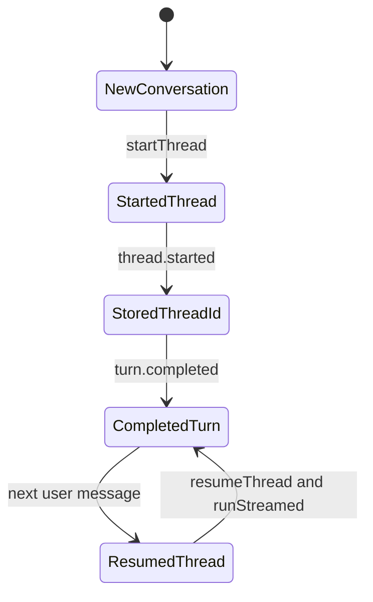
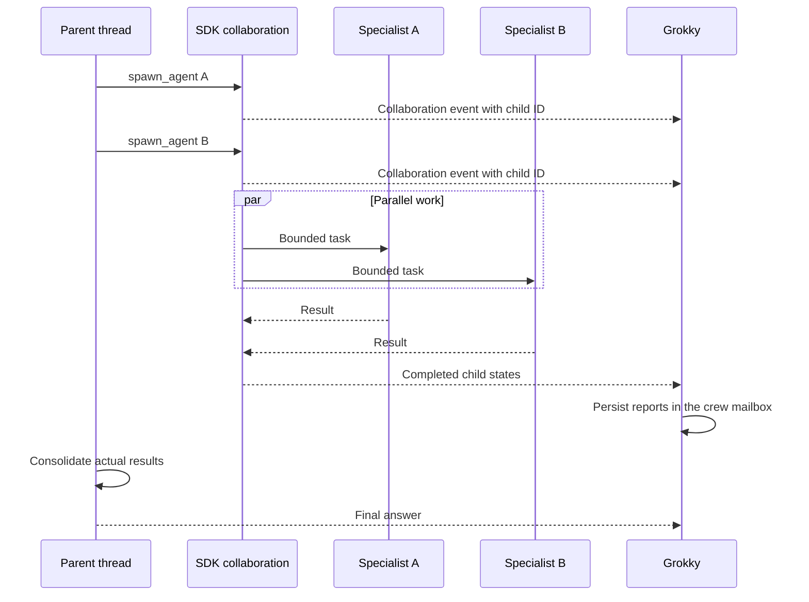

# Codex SDK integration

This guide explains how Grokky uses the official Codex SDK, how authentication and thread persistence work, which options are applied, how multi-agent events reach the interface, and what changes when Electron is packaged.

Primary references:

- [Codex SDK guide](https://learn.chatgpt.com/docs/codex-sdk)
- [`@openai/codex-sdk` package](https://www.npmjs.com/package/@openai/codex-sdk)

## Integration boundary

The SDK runs only in Electron's main process.

```mermaid
flowchart LR
  UI[React renderer] -->|typed IPC| MAIN[MainController]
  MAIN --> ADAPTER[Codex provider]
  ADAPTER --> SDK[@openai/codex-sdk]
  SDK --> CLI[Local Codex runtime]
  CLI --> AUTH[Existing Codex sign-in]
  CLI --> WORKSPACE[Selected workspace]
  CLI --> REMOTE[OpenAI services]
```

The renderer can choose a provider, model, reasoning level, workspace, and allowed product features. It cannot construct an SDK client, inspect environment variables, read Codex auth files, or receive SDK objects.

## Authentication

Grokky reuses the normal saved Codex sign-in. It does not accept an OpenAI API key through the interface.

Provider readiness checks look for a readable auth record under:

```text
${CODEX_HOME}/auth.json
```

or, when `CODEX_HOME` is unset:

```text
$HOME/.codex/auth.json
```

Sign in with the normal Codex workflow before launching the app:

```bash
codex login
```

The readiness check only reports whether the auth file is readable. The SDK and local Codex runtime own the actual authentication lifecycle.

## Client creation

`runCodex` creates a client for each conversation turn so the configuration reflects current application settings.

The client configuration enables or disables:

| SDK feature | Grokky source |
| --- | --- |
| Apps | Connectors enabled setting |
| Plugins | Connectors enabled setting |
| Browser use | Local computer selected and browser capability always allowed |
| Computer use | Local computer selected and both screen and automation always allowed |
| Image generation | Disabled |
| Multi-agent | Multi-agent enabled setting |
| Skill search | Enabled |
| Workspace dependencies | Enabled |

Agent configuration includes:

- `enabled`
- `max_concurrent_threads_per_session`
- Optional default subagent model
- Optional default subagent reasoning effort
- Whether child-agent updates may interrupt the coordinator

## Per-thread options

Every run derives thread options from the conversation and application settings:

```ts
const options = {
  workingDirectory: conversation.workingDirectory,
  model: conversation.model,
  modelReasoningEffort: conversation.reasoning,
  sandboxMode: conversation.sandboxMode,
  networkAccessEnabled: settings.connectorsEnabled || nativeBrowserEnabled,
  webSearchMode: settings.webSearchEnabled ? "live" : "disabled",
  approvalPolicy: "never",
  skipGitRepoCheck: true,
};
```

Important details:

- The selected project is explicit for every thread. No-project chats use an isolated Grokky scratch folder, never the user's home directory.
- The composer exposes Read only, Workspace access, and Full access. Full access enables local development commands while the SDK workspace sandbox remains rooted in the selected project.
- Live search is not silently implied. It follows the Grokky setting.
- `skipGitRepoCheck` allows work in ordinary folders, not just Git repositories.
- `approvalPolicy: "never"` prevents a second hidden approval flow from competing with the interface. Grokky-owned OpenRouter tools use visible product approvals. Native Codex browser and computer features are enabled only for persistent allow policies because their per-action approval lifecycle is not exposed through this renderer.

## Start and resume

The conversation's `threadId` selects the SDK operation:

```ts
const thread = conversation.threadId
  ? codex.resumeThread(conversation.threadId, options)
  : codex.startThread(options);
```

The first `thread.started` event saves the ID into local conversation state. Later turns resume the same thread while applying the current options. A chat can therefore survive an app relaunch without copying its full context into an SDK prompt.



## Streaming

Grokky calls:

```ts
const { events } = await thread.runStreamed(prompt, { signal });

for await (const event of events) {
  await handleEvent(event, context, eventState);
}
```

The caller supplies an `AbortSignal`, so the toolbar stop action can cancel the SDK run. Events are processed sequentially to preserve activity ordering and snapshot consistency.

## Event translation

`handleEvent` converts SDK events into the provider-neutral event union used by the controller.

### Thread and final state

| Input | Output |
| --- | --- |
| `thread.started` | `{ type: "thread", threadId }` |
| Final completed `agent_message` | Buffered final response |
| `turn.completed` | Final response plus normalized token usage |
| `turn.failed` | Thrown error |
| Top-level SDK error | Thrown error |

An agent message is buffered until another agent message or turn completion. Intermediate coordinator prose becomes a completed notice. The final buffered message becomes the actual assistant response. This keeps useful coordination visible without turning every progress sentence into a separate chat bubble.

### Activity

| SDK item | Activity kind | Notes |
| --- | --- | --- |
| `reasoning` | `reasoning` | Text detail |
| `command_execution` | `command` | First command line, capped aggregate output, SDK status |
| `file_change` | `files` | Change count, kind, and path |
| `mcp_tool_call` | `tool` | Server and tool name plus error detail |
| `todo_list` | `plan` | Completed and pending checklist rows |
| `web_search` | `tool` | Query detail |
| `error` | `notice` | Failure unless the message is a recognized benign notice |

The known skill-description context-budget notice is filtered because it describes SDK prompt compaction, not a failed run. Model-change messages render as completed notices instead of errors.

## Interactive browser routing

Grokky routes recognized interactive-browser requests from a Codex conversation to OpenRouter with an online paired cloud browser. If OpenRouter or that device is unavailable, the request stops with a setup message. This is an explicit product routing path; it does not make the Codex runtime execute on the remote computer.

Ordinary Codex work remains local. Native browser features depend on approved origins and runtime support, and native computer features require both screen and automation set to Always allow. For a first computer-use setup, follow the [README's cloud and local Mac paths](../README.md#set-up-computer-use).

## Native multi-agent orchestration

With multi-agent enabled and no crew selected, the composer shows **Auto**. Codex can choose native agents in response to a conversational request. The rollout observer runs for every enabled multi-agent turn, including an empty picker selection, so native child assignments and reports remain visible. Disabling multi-agent disables native delegation and this observer.

When a crew is selected, Grokky prepends an exact roster and an execution contract to the user prompt. The contract requires one successful `spawn_agent` call per role, parallel spawning before waits, and consolidation only after child results exist.

Legacy SDK streams emit collaboration items containing:

- Operation ID
- Tool name such as `spawn_agent` or `wait`
- Sender thread ID
- Receiver thread IDs
- Agent state map
- Prompt
- Operation status

Those runtimes can encode a child state as either a string such as `pending_init` or a keyed object such as `{ completed: "report text" }`. They can also provide `receiver_agents` metadata with the specialist role. Grokky normalizes both shapes so it does not drop real role names or completed reports when the runtime evolves.

Sol's v2 collaboration protocol records `SubAgentActivity` starts and child-authored `FINAL_ANSWER` messages in the active root thread's local Codex rollout JSONL, but the public SDK currently suppresses those records. `codex-rollout-observer.ts` tails only that active file, ignores entries older than the current turn, maps confirmed child IDs and plaintext final payloads, and ignores encrypted intermediate messages. This fallback produces the same provider-neutral `OrchestrationEvent` contract as legacy SDK items.

`orchestrationFromThreadEvent` translates these into `OrchestrationEvent` records. It maps names by explicit prompt match, receiver order, and a stable thread-to-name cache. The controller then converts provider statuses into Grokky's `starting`, `working`, `waiting`, `completed`, `failed`, or `stopped` states.

Every confirmed assignment, direct message, report, and control signal also becomes a persisted `CrewCommunication` record. The crew card's Messages tab renders these records chronologically, groups consecutive sends by speaker, and shows the real sender, receiver, exact content, exceptional status, and timestamp while keeping raw orchestration tool names out of the user-facing transcript. Selected roles are labelled as awaiting spawn until the provider emits evidence. Assistant prose is never converted into crew traffic.



Grokky does not parse ordinary assistant text to claim an agent ran. A real collaboration event is required.

## Skills, MCP, and connectors

Grokky does not inject skill text or MCP definitions into the SDK prompt. It manages the user's standard Codex configuration and lets Codex discover capabilities through its normal runtime.

The settings interface reads and updates:

- `[[skills.config]]` entries
- `[mcp_servers.*]` tables
- `[plugins.*]` tables

All writes target `$HOME/.codex/config.toml`, preserve unrelated content, use mode `0600`, and replace the file atomically.

## Packaged Electron binary

Development mode can resolve the Codex runtime from `node_modules`. Packaged Electron code lives inside `app.asar`, which is not a real directory that a native executable can be spawned from.

The build configuration unpacks:

```text
node_modules/@openai/codex-darwin-*/vendor/**/*
node_modules/@openai/codex-win32-*/vendor/**/*
```

At runtime, `packagedCodexPath()` builds the real path under:

```text
macOS:  app.asar.unpacked/node_modules/@openai/codex-darwin-*/vendor/*-apple-darwin/bin/codex
Windows: app.asar.unpacked/node_modules/@openai/codex-win32-*/vendor/*-pc-windows-msvc/bin/codex.exe
```

If the file exists, Grokky passes it as `codexPathOverride`. This prevents `ENOTDIR` spawn failures caused by virtual ASAR paths.

## Adding a new Codex option

1. Decide whether it is app-wide or conversation-specific.
2. Add a serializable field to `AppSettings` or `Conversation`.
3. Validate it in `src/shared/validation.ts`.
4. Normalize a persisted fallback in `StateStore.load`.
5. Add the renderer control.
6. Map it into the SDK config or thread options in `runCodex`.
7. Add a deterministic test and a credential-gated live test when behavior depends on the SDK runtime.
8. Run `npm run verify` and the relevant Codex smoke command.

## Troubleshooting

### Codex shows as not signed in

- Run `codex login` in a terminal.
- Confirm `CODEX_HOME` points to the same Codex home used by the login command.
- Refresh provider status in Grokky.

### A packaged run fails to spawn

- Confirm `asarUnpack` still includes the platform vendor package.
- Inspect the packaged `app.asar.unpacked` tree.
- Confirm `packagedCodexPath()` matches the CPU architecture.

### A crew appears selected but no specialists run

- Confirm multi-agent is enabled in settings.
- Check the activity stream for failed collaboration calls.
- Run `npm run smoke:multiagent`.
- Do not treat assistant prose about delegation as proof. The provider must receive collaboration events.

### Web claims appear without live search

- Confirm web search is enabled.
- Check for a `web_search` activity item.
- Run `npm run smoke:codex-web` for credential-gated verification.
