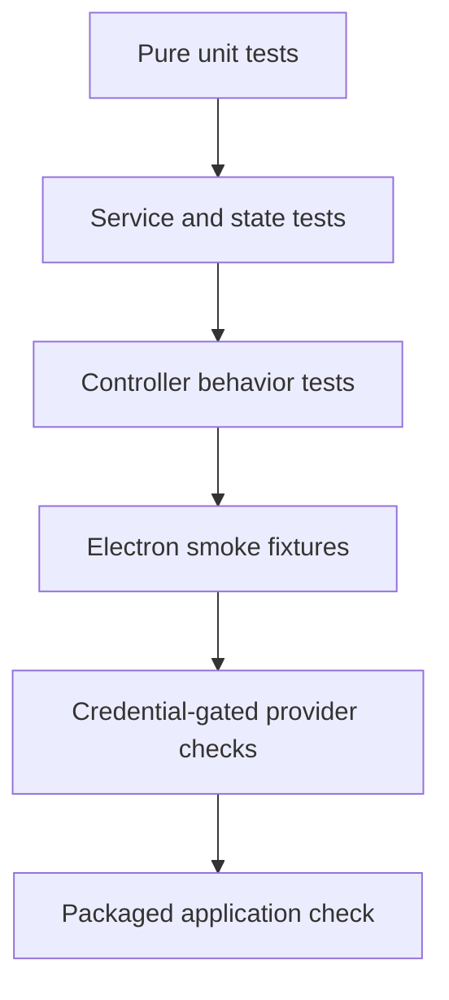

# Development and release workflow

## Prerequisites

- macOS on Apple Silicon or Windows on x64 for native packaging
- Node.js 20.19 or newer
- npm 10 or newer
- Xcode Command Line Tools for macOS packaging workflows
- Optional saved Codex sign-in
- Optional OpenRouter API key

## Bootstrap

```bash
npm ci
npm run dev
```

`electron-vite` starts the renderer development server, compiles main and preload code, and launches Electron.

## Scripts

| Command | Purpose | Credentials required |
| --- | --- | :---: |
| `npm run dev` | Start development Electron app | No |
| `npm run hygiene` | Scan source and docs for private paths, secrets, and writing-policy violations | No |
| `npm run typecheck` | Run TypeScript without emitting | No |
| `npm test` | Run deterministic Vitest suite | No |
| `npm run build` | Build main, preload, and renderer | No |
| `npm run verify` | Hygiene, typecheck, tests, and build | No |
| `npm run smoke:codex` | Basic live SDK thread | Codex |
| `npm run smoke:codex-provider` | Live provider adapter | Codex |
| `npm run smoke:codex-web` | Live Codex web search | Codex |
| `npm run smoke:multiagent` | Live native child threads | Codex |
| `npm run smoke:openrouter` | Basic live OpenRouter chat | OpenRouter |
| `npm run smoke:openrouter-crew` | Parallel specialists plus lead | OpenRouter |
| `npm run smoke:openrouter-web` | Auditable server-side web search | OpenRouter |
| `npm run smoke:electron` | Run the narrow Tasks, Meeting, live/historical Watch, and approval renderer fixture matrix with viewport assertions | No |
| `npm run package:mac:dir` | Build and verify an unpacked Apple Silicon app on macOS | No |
| `npm run package:mac` | Build and verify an Apple Silicon DMG on macOS | No |
| `npm run package:win:dir` | Build and verify an unpacked Windows x64 app on Windows | No |
| `npm run package:win` | Build and verify a Windows x64 NSIS installer on Windows | No |
| `npm run verify:package:mac` | Verify the bundled macOS Codex executable | No |
| `npm run verify:package:win` | Verify the bundled Windows Codex executable | No |
| `npm run runner` | Build and start remote workspace runner | No |
| `npm run sandbox:dev` | Start the optional Cloudflare Sandbox gateway locally (Docker required) | No |
| `npm run sandbox:verify` | Typecheck, test, and dry-run-build the Sandbox gateway | No |

## Development loop

1. Trace the feature through shared contract, validation, preload, IPC, controller, provider or service, and renderer.
2. Make the smallest coherent change across those layers.
3. Add deterministic tests for domain behavior and boundaries.
4. Add a smoke fixture when visual state or live-provider behavior matters.
5. Run targeted tests while iterating.
6. Run `npm run verify` before commit.
7. Run credential-gated smoke checks proportional to the provider change.

`npm run smoke:electron` resolves the installed Electron executable directly so the same launcher works on macOS and Windows. It verifies six deterministic UI states at explicit content viewport sizes: typed Tasks, moderated Meeting, automatic Watch, historical lead-seat Watch, the computer approval gate, and cloud-computer pairing. Each case fails if Electron clamps the requested viewport, if the live desktop is too short to watch, or if the fixture escapes its responsive boundary. To inspect one state, set `GROKKY_SMOKE_VIEW` (for example `crew-tasks`, `crew-meeting`, `agent-watch-auto`, `computer-history`, `computer-approval`, or `computer-pair`); optional `GROKKY_SMOKE_WIDTH`, `GROKKY_SMOKE_HEIGHT`, and `GROKKY_SMOKE_SCREENSHOT_PATH` values override that single case.

## Testing layers



### Deterministic suite

The default suite must run without local credentials, network access, personal agents, or an existing conversation database. Tests use temporary directories and provider fixtures.

### Electron smoke fixtures

`src/main/index.ts` contains isolated smoke views enabled only by environment variables. They publish controlled snapshots and verify layout, focus, menus, deletion, activity, approvals, crew states, themes, and responsive behavior.

Smoke screenshots are written to ignored output folders. Do not commit them unless they are regenerated from sanitized fixtures and manually checked for paths, hostnames, user content, and image metadata.

### Live provider tests

Live integration tests are skipped unless their explicit environment flag is set. They should verify the smallest provider contract possible and avoid broad workspace access or expensive prompts.

## Adding UI state

1. Add durable state to a shared contract only when it must survive reload.
2. Add transient UI-only state inside React.
3. Validate all renderer-supplied durable values.
4. Normalize a fallback for old state files.
5. Keep the main process authoritative.
6. Add focus, dismissal, empty, loading, error, and narrow-window behavior.
7. Add or extend an Electron smoke fixture.

## Adding IPC

Every new renderer-to-main action requires:

1. A named channel in `IPC`
2. A typed method in `GrokkyApi`
3. A preload method
4. Runtime validation in the main IPC handler
5. A controller or service method
6. A test for invalid and valid input

Never expose raw `ipcRenderer`, Node modules, shell execution, arbitrary channel names, or a generic invoke method.

## Adding persistent state

The persisted schema is versioned. A schema change should:

1. Extend the TypeScript state type.
2. Provide a safe default.
3. Normalize existing untrusted JSON.
4. Bound array sizes and string values where practical.
5. Avoid plaintext credentials.
6. Add a migration or normalization test.
7. Keep save operations atomic.

## Styling

The renderer uses custom CSS rather than a generic component library. Reuse the design tokens and primitives in:

- `src/renderer/src/grokky-system.css`
- `src/renderer/src/premium.css`
- `src/renderer/src/styles.css`

Before adding a new component:

- Use existing spacing, type, color, radius, shadow, and layer tokens.
- Preserve the selected accent palette.
- Verify dark, light, and system themes.
- Test narrow and minimum window sizes.
- Check popover and modal stacking against the toolbar and composer.
- Provide visible focus and keyboard dismissal.
- Use distinct mascot identities for named agents.
- Avoid tiny explanatory type and generic pill-heavy layouts.
- Do not introduce em dashes into product copy.

## Package layout

`electron-builder` writes packages under `release/`, which Git ignores. The native targets are Apple Silicon macOS and Windows x64. Both use `build/icon-mascot.png` and unpack the matching Codex vendor executable from `app.asar`.

The Codex native vendor directories must remain in `asarUnpack`. Removing either can produce a build that launches but cannot spawn its packaged runtime. `package-platform.mjs` blocks cross-operating-system packaging, builds the application, and runs the matching package verification automatically. The standalone verification commands remain available for CI and package inspection.

Do not treat Electron's ability to emit another operating system's app shell as a supported release path. npm installs only the Codex executable for the host platform by default, so an unchecked cross-build can be incomplete. GitHub Actions builds each target on its native runner from the same commit.

## Release checklist

- [ ] `npm ci` completes from the lockfile.
- [ ] `npm run verify` passes.
- [ ] Relevant live Codex smoke checks pass.
- [ ] Relevant live OpenRouter smoke checks pass.
- [ ] The Electron smoke suite passes at wide and narrow dimensions.
- [ ] The Cloudflare gateway type generation, tests, and Wrangler dry-run bundle pass.
- [ ] App icon, Dock icon, window icon, and mascot assets are correct.
- [ ] Sessions can be created, switched, cancelled, and deleted.
- [ ] Crew selection dismisses by outside click and Escape.
- [ ] Distinct agent icons persist through agent create and edit.
- [ ] Work log renders Markdown and tables correctly.
- [ ] Settings navigation remains visible and usable.
- [ ] Provider, model, and reasoning menus stack above messages.
- [ ] Computer approvals deny, allow once, and allow for chat correctly.
- [ ] Agent Watch attributes actions and approvals to the correct seat, verifies captured evidence, closes with Escape, and remains usable at narrow widths.
- [ ] Crew Tasks fold follow-ups into one lifecycle, preserve final evidence, and stop truthfully when a provider turn ends early.
- [ ] Crew Meeting shows only observed contributions, explicit decisions, and an incomplete warning when any participant did not report.
- [ ] The local state and release directories are absent from Git status.
- [ ] No screenshot or documentation contains a personal path or host.
- [ ] The packaged Codex path resolves outside `app.asar` on macOS and Windows.
- [ ] macOS and Windows packages come from the same commit.
- [ ] Each package is signed, and the macOS package is notarized, before external distribution.

## Continuous integration

`.github/workflows/verify.yml` runs deterministic verification plus the complete Electron fixture suite on native macOS arm64 and Windows x64 runners for pushes to `main` and pull requests. A separate Linux job generates Cloudflare bindings, typechecks and tests the gateway, and produces a Wrangler dry-run deployment bundle. Only after all three gates pass does a push package a DMG and a Windows NSIS installer, verify the platform Codex binary inside each unpacked app, and upload the installers as short-lived workflow artifacts. Live provider tests and a live Cloudflare deployment are intentionally excluded from CI because secrets, billing authority, and model usage are not required for ordinary pull requests.

See [Windows support and release](WINDOWS.md) for the native Windows contract and [Cloudflare computer deployment and operations](CLOUDFLARE-COMPUTER.md) for the billable service release procedure.
