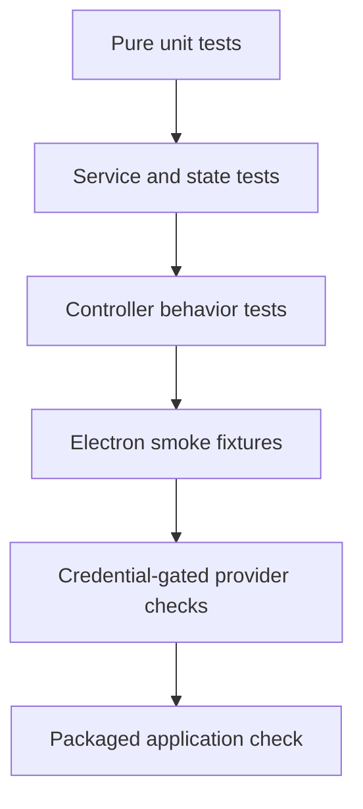

# Development and release workflow

## Prerequisites

- macOS for native desktop controls and packaging
- Node.js 20.19 or newer
- npm 10 or newer
- Xcode Command Line Tools for native packaging workflows
- Optional saved Codex sign-in
- Optional OpenRouter API key

## Bootstrap

```bash
npm ci
npm run dev
```

`electron-vite` starts the renderer development server, compiles main and preload code, and launches Electron.

## Scripts

| Command | Purpose | Credentials required |
| --- | --- | :---: |
| `npm run dev` | Start development Electron app | No |
| `npm run hygiene` | Scan source and docs for private paths, secrets, and writing-policy violations | No |
| `npm run typecheck` | Run TypeScript without emitting | No |
| `npm test` | Run deterministic Vitest suite | No |
| `npm run build` | Build main, preload, and renderer | No |
| `npm run verify` | Hygiene, typecheck, tests, and build | No |
| `npm run smoke:codex` | Basic live SDK thread | Codex |
| `npm run smoke:codex-provider` | Live provider adapter | Codex |
| `npm run smoke:codex-web` | Live Codex web search | Codex |
| `npm run smoke:multiagent` | Live native child threads | Codex |
| `npm run smoke:openrouter` | Basic live OpenRouter chat | OpenRouter |
| `npm run smoke:openrouter-crew` | Parallel specialists plus lead | OpenRouter |
| `npm run smoke:openrouter-web` | Auditable server-side web search | OpenRouter |
| `npm run smoke:electron` | Launch packaged renderer fixture and UI assertions | No |
| `npm run package:dir` | Create unpacked Apple Silicon app | No |
| `npm run package:dmg` | Create Apple Silicon DMG | No |
| `npm run runner` | Build and start remote workspace runner | No |

## Development loop

1. Trace the feature through shared contract, validation, preload, IPC, controller, provider or service, and renderer.
2. Make the smallest coherent change across those layers.
3. Add deterministic tests for domain behavior and boundaries.
4. Add a smoke fixture when visual state or live-provider behavior matters.
5. Run targeted tests while iterating.
6. Run `npm run verify` before commit.
7. Run credential-gated smoke checks proportional to the provider change.

## Testing layers



### Deterministic suite

The default suite must run without local credentials, network access, personal agents, or an existing conversation database. Tests use temporary directories and provider fixtures.

### Electron smoke fixtures

`src/main/index.ts` contains isolated smoke views enabled only by environment variables. They publish controlled snapshots and verify layout, focus, menus, deletion, activity, approvals, crew states, themes, and responsive behavior.

Smoke screenshots are written to ignored output folders. Do not commit them unless they are regenerated from sanitized fixtures and manually checked for paths, hostnames, user content, and image metadata.

### Live provider tests

Live integration tests are skipped unless their explicit environment flag is set. They should verify the smallest provider contract possible and avoid broad workspace access or expensive prompts.

## Adding UI state

1. Add durable state to a shared contract only when it must survive reload.
2. Add transient UI-only state inside React.
3. Validate all renderer-supplied durable values.
4. Normalize a fallback for old state files.
5. Keep the main process authoritative.
6. Add focus, dismissal, empty, loading, error, and narrow-window behavior.
7. Add or extend an Electron smoke fixture.

## Adding IPC

Every new renderer-to-main action requires:

1. A named channel in `IPC`
2. A typed method in `GrokkyApi`
3. A preload method
4. Runtime validation in the main IPC handler
5. A controller or service method
6. A test for invalid and valid input

Never expose raw `ipcRenderer`, Node modules, shell execution, arbitrary channel names, or a generic invoke method.

## Adding persistent state

The persisted schema is versioned. A schema change should:

1. Extend the TypeScript state type.
2. Provide a safe default.
3. Normalize existing untrusted JSON.
4. Bound array sizes and string values where practical.
5. Avoid plaintext credentials.
6. Add a migration or normalization test.
7. Keep save operations atomic.

## Styling

The renderer uses custom CSS rather than a generic component library. Reuse the design tokens and primitives in:

- `src/renderer/src/grokky-system.css`
- `src/renderer/src/premium.css`
- `src/renderer/src/styles.css`

Before adding a new component:

- Use existing spacing, type, color, radius, shadow, and layer tokens.
- Preserve the selected accent palette.
- Verify dark, light, and system themes.
- Test narrow and minimum window sizes.
- Check popover and modal stacking against the toolbar and composer.
- Provide visible focus and keyboard dismissal.
- Use distinct mascot identities for named agents.
- Avoid tiny explanatory type and generic pill-heavy layouts.
- Do not introduce em dashes into product copy.

## Package layout

`electron-builder` writes packages under `release/`, which Git ignores. The macOS configuration targets Apple Silicon and uses `build/icon-mascot.png`.

The Codex native vendor directory must remain in `asarUnpack`. Removing it can produce a build that launches but cannot spawn the packaged runtime.

## Release checklist

- [ ] `npm ci` completes from the lockfile.
- [ ] `npm run verify` passes.
- [ ] Relevant live Codex smoke checks pass.
- [ ] Relevant live OpenRouter smoke checks pass.
- [ ] The Electron smoke suite passes at wide and narrow dimensions.
- [ ] App icon, Dock icon, window icon, and mascot assets are correct.
- [ ] Sessions can be created, switched, cancelled, and deleted.
- [ ] Crew selection dismisses by outside click and Escape.
- [ ] Distinct agent icons persist through agent create and edit.
- [ ] Work log renders Markdown and tables correctly.
- [ ] Settings navigation remains visible and usable.
- [ ] Provider, model, and reasoning menus stack above messages.
- [ ] Computer approvals deny, allow once, and allow for chat correctly.
- [ ] The local state and release directories are absent from Git status.
- [ ] No screenshot or documentation contains a personal path or host.
- [ ] The packaged Codex path resolves outside `app.asar`.
- [ ] The package is signed and notarized before external distribution.

## Continuous integration

`.github/workflows/verify.yml` runs on macOS for pushes to `main` and pull requests. It installs from `package-lock.json` and runs `npm run verify`. Live provider tests are intentionally excluded from CI because secrets and model usage are not required for ordinary pull requests.
