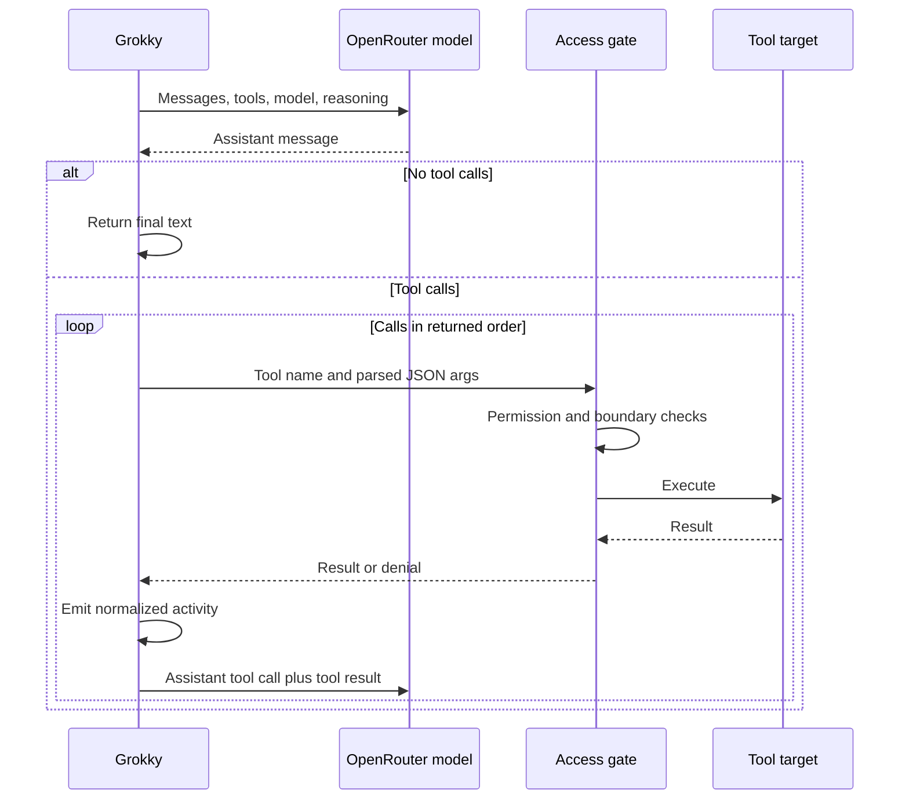
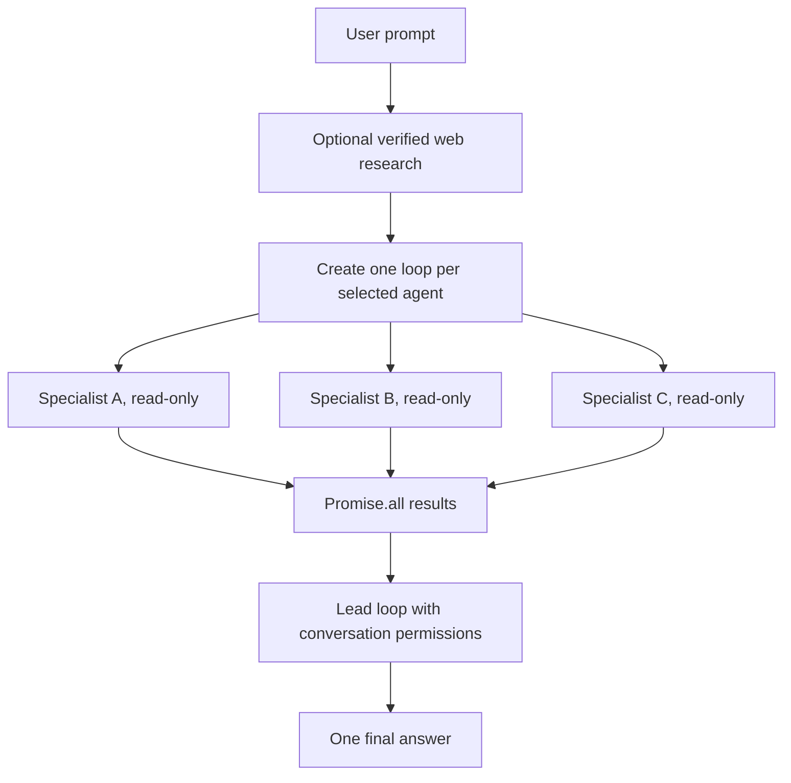

# OpenRouter integration

This guide explains credential resolution, model calls, tool execution, web search, multi-agent orchestration, usage accounting, and the current boundary between OpenRouter and Codex-native capabilities.

Primary references:

- [OpenRouter TypeScript SDK](https://openrouter.ai/docs/client-sdks/typescript/overview)
- [Chat API](https://openrouter.ai/docs/agent-sdk/typescript/api-reference/chat)
- [Tool calling](https://openrouter.ai/docs/guides/features/tool-calling)
- [Server tools](https://openrouter.ai/docs/guides/features/server-tools/overview)
- [Web search](https://openrouter.ai/docs/guides/features/server-tools/web-search)

## Integration boundary

```mermaid
flowchart LR
  UI[React renderer] -->|provider, model, settings| MAIN[MainController]
  MAIN --> KEY[Credential resolver]
  MAIN --> PROVIDER[OpenRouter provider]
  KEY -->|key only in memory| PROVIDER
  PROVIDER --> SDK[@openrouter/sdk]
  PROVIDER --> WEB[OpenRouter web-search endpoint]
  PROVIDER --> ACCESS[Computer access gate]
  ACCESS --> LOCAL[Local bounded tools]
  ACCESS --> REMOTE[Paired runner]
```

The OpenRouter key exists only in Electron's main process. The renderer sees a readiness label and source description, never the value.

## Credential resolution

`resolveOpenRouterCredential` checks sources in this order:

1. `OPENROUTER_API_KEY` in the inherited process environment
2. The env file path saved in Grokky settings
3. The path in `GROKKY_OPENROUTER_ENV_FILE`
4. `$HOME/.config/grokky/.env`

An env file may use plain, quoted, or exported syntax:

```dotenv
OPENROUTER_API_KEY=replace_with_your_key
export OPENROUTER_API_KEY="replace_with_your_key"
```

The resolver requires an OpenRouter-style `sk-or-v1-` key with a non-placeholder value. Unreadable candidates are skipped. The selected file path may be stored so the app can resolve it on later launches, but the file contents and key are never copied into `conversations.json`.

## Client construction

The provider creates a typed SDK client per run:

```ts
const client = new OpenRouter({
  apiKey: context.apiKey,
  appTitle: "Grokky",
  appCategories: "desktop-agent,local-agent",
  timeoutMs: 180_000,
});
```

Each chat request also supplies the bearer header explicitly, uses the conversation ID as `sessionId`, and carries the current abort signal.

## Message construction

A lead run receives:

1. A Grokky system contract
2. Up to 40 preceding conversation messages
3. The current user prompt
4. Optional verified live-web findings
5. Optional specialist findings

The base system contract states the selected workspace, read/write state, command state, live-web state, evidence rules, secret rules, and product writing style.

Specialists do not receive chat history. Each gets one bounded task plus its agent description and developer instructions. This isolates their analysis and reduces agreement-by-copying.

## Dynamic tool catalog

The available tool list is rebuilt for each loop from:

- Global computer-access state
- Active local or remote device capabilities
- Capability policy
- Conversation sandbox mode
- Conversation command toggle
- Whether the loop is a read-only specialist

| Tool | Capability | Specialist | Additional condition |
| --- | --- | :---: | --- |
| `list_files` | Files | Yes | Files not blocked |
| `search_files` | Files | Yes | Files not blocked |
| `read_file` | Files | Yes | Files not blocked |
| `create_file` | Files | No | Workspace-write mode |
| `edit_file` | Files | No | Workspace-write mode |
| `run_command` | Commands | No | Workspace-write and commands enabled |
| `browse_url` | Browser | Yes | Browser not blocked |
| `capture_screen` | Screen | Yes | Screen not blocked |
| `open_application` | Automation | No | Automation not blocked |
| `click_screen` | Automation | No | Automation not blocked |
| `type_text` | Automation | No | Automation not blocked |

Tools are advertised to the model only when the selected device supports them. A remote workspace runner currently advertises files and optionally commands, so it cannot accidentally receive screen or UI automation calls.

## Tool loop



The implementation uses:

- Non-streaming typed chat responses
- `toolChoice: "auto"`
- `parallelToolCalls: false`
- A maximum of eight model rounds
- A 180-second SDK timeout
- Sequential tool execution in response order
- Model-visible `Tool error:` results when a bounded action fails

Sequential tool calls prevent two model-requested writes from racing against the same file. Crew members themselves can still run in parallel because they are read-only.

## Screen capture attachments

The local screen host first writes a private temporary capture. The controller immediately imports it into Grokky's application-owned evidence store, hashes it, removes the temporary source, and returns a typed provider result that points at the owned artifact. `openRouterToolContent` reads only that trusted attachment field and converts the PNG into an inline data URL plus explanatory text; it never derives an attachment path by parsing model-visible output.

Safeguards:

- Capture requires macOS Screen Recording permission.
- The file is created with private permissions under Electron's temp area.
- Attachments larger than 10 MB are rejected.
- The image data is sent only to the active OpenRouter request.
- The pathname and image bytes are not persisted in conversation state.

## Live web research

Grokky uses OpenRouter's current server tool type, not the deprecated plugin-style web-search syntax:

```json
{
  "type": "openrouter:web_search",
  "parameters": {
    "engine": "auto",
    "max_results": 5,
    "max_total_results": 10,
    "max_uses": 3,
    "search_context_size": "medium"
  }
}
```

### Trigger

The research stage runs only when:

- Web search is enabled in settings, and
- The prompt contains an online or current-information intent such as search, browse, latest, current, news, sources, URL, or website.

### Audit requirements

The request sets `tool_choice` to required. Grokky accepts the result only when all three are present:

1. At least one reported server web-search request
2. At least one URL citation annotation
3. Non-empty research text

If the evidence is incomplete, the provider retries once. A second incomplete response fails the web-research stage instead of allowing the model to imply it searched.

The completed activity records:

- Search request count
- Research model
- Direct source URLs
- Whether a retry was required

The research brief and source links are added to the lead prompt. Usage and cost are added to the final conversation total.

## OpenRouter crew orchestration

OpenRouter does not expose Codex child threads, so Grokky provides its own equivalent orchestration layer.



For each agent, Grokky:

1. Generates a synthetic OpenRouter thread ID for UI correlation.
2. Emits a real `spawn_agent` orchestration event.
3. Applies the agent's optional model and reasoning overrides.
4. Forces read-only workspace mode and disables commands.
5. Runs the tool loop independently.
6. Emits a `wait` event containing the completed finding or failure.

All agent promises begin before the provider awaits them. The lead runs only after the entire `Promise.all` settles. Failed specialists return an explicit failure finding so the lead and user can see degraded crew coverage.

The lead receives every specialist block with a role label, resolves disagreements, owns all final decisions, and is the only OpenRouter participant that can receive write or automation tools.

## Usage aggregation

Grokky normalizes:

- Input tokens
- Cached input tokens
- Output tokens
- Reasoning tokens
- Cost in US dollars when returned

Usage is accumulated across:

1. Optional web-research attempts
2. Every specialist loop and tool round
3. Every lead loop and tool round

The final `UsageSummary` is emitted once after the final answer.

## Current limitations

### Skills, MCP, and connectors

Codex skills, MCP servers, and connector plugins are configured for the Codex runtime. They are not automatically serialized into OpenRouter tools. OpenRouter currently receives only Grokky's audited built-in tool catalog.

Adding OpenRouter MCP support requires:

1. Discovering a server's schemas without exposing unrelated configuration.
2. Mapping schemas into OpenRouter tool definitions.
3. Routing every call through the same capability and audit model.
4. Handling remote authentication without sending secrets through React or conversation state.
5. Defining specialist read-only behavior for third-party tools.

### History window

The lead sends the most recent 40 prior chat messages, not the full persisted conversation. This is a simple bounded history policy rather than semantic memory.

### Web-search model

Live web research currently uses a dedicated search-capable model constant, while final synthesis continues on the lead model selected for the conversation. If research routing becomes user-configurable, preserve the evidence requirements and do not assume every model supports the same server tool.

## Adding a tool

1. Define a strict `ChatFunctionTool` schema.
2. Add a `ComputerToolName` and capability mapping.
3. Add target labeling for approvals and audit.
4. Implement the operation behind `ComputerAccessService` or the bounded workspace tool layer.
5. Validate paths, URLs, sizes, timeouts, output caps, and platform support.
6. Decide whether read-only specialists may receive the tool.
7. Decide whether remote devices advertise the capability.
8. Add deterministic permission, failure, and content tests.
9. Run `npm run verify` plus the relevant live smoke check.

## Troubleshooting

### OpenRouter shows as not configured

- Confirm the key uses the `sk-or-v1-` format.
- Confirm the launching shell exported `OPENROUTER_API_KEY`, or select the correct env file in settings.
- Confirm the env file uses an exact `OPENROUTER_API_KEY` assignment.
- Refresh provider status.

### The model talks about tools but does not use them

- Confirm Computer access is enabled.
- Confirm the active device advertises the needed capability.
- Confirm the capability is not blocked.
- Confirm writes or commands are allowed by the conversation.
- Inspect the work log for returned tool calls.

### Current answers have no sources

- Confirm live web search is enabled.
- Use a prompt that clearly requests current or online research.
- Inspect the `Live web search` activity for search count and direct URLs.
- Run `npm run smoke:openrouter-web`.

### Specialists appear serial

- Confirm more than one agent is selected.
- Confirm multi-agent is enabled and the thread limit is high enough.
- Run `npm run smoke:openrouter-crew`.
- Review the provider for an accidental replacement of `Promise.all` with sequential awaits.
