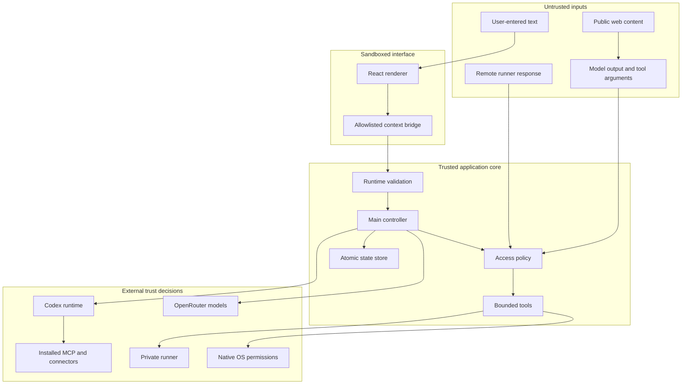

# Security and privacy

Grokky is a local desktop agent with explicit access to files, model providers, and optional computer controls. This document describes the trust model, protected assets, enforced boundaries, known limitations, and repository-publication rules.

Security claims here apply to the source in this repository. Unsigned local builds, third-party models, installed skills, MCP servers, connectors, and user-selected workspaces remain separate trust decisions.

## Security objectives

1. Keep provider credentials out of the renderer and repository.
2. Keep file and command tools inside the selected workspace.
3. Make sensitive actions visible, configurable, and auditable.
4. Prevent browser tools from becoming a private-network request primitive.
5. Prevent a paired runner from widening permissions beyond its startup boundary.
6. Keep local conversation state private to the operating-system user.
7. Fail closed when a capability, target, credential, or native permission is unavailable.
8. Never use the user's home directory as an implicit project. No-project sessions are rooted in an isolated Grokky scratch folder.

## Assets

| Asset | Sensitivity | Storage owner |
| --- | --- | --- |
| Codex sign-in material | Secret | Codex home, not Grokky state |
| OpenRouter API key | Secret | Process environment or user-selected env file |
| Runner bearer token | Secret | Runner private state; encrypted in Grokky state |
| Conversations and messages | Private user data | Electron user-data directory |
| Workspace files | Potentially private | User-selected workspace |
| Agent definitions | Potentially private | Codex personal or project agent folders |
| Codex configuration | Potentially sensitive | Codex home |
| Screen captures | Highly sensitive | Application-owned evidence directory; temporary source removed after import |
| Agent browser evidence | Highly sensitive | Electron user-data directory |
| Audit history | Private operational metadata | Grokky local state |

## Trust zones

Model-generated JSON arguments are untrusted even after schema validation. Every operation revalidates its own paths, sizes, mode, and target at execution time.

## Renderer isolation

The browser window uses a sandboxed renderer with context isolation and no Node integration. The preload exposes named methods only. Main-process IPC handlers validate IDs, messages, settings, agent drafts, URLs, pairing codes, access levels, and allowlists before invoking the controller.

Navigation protections:

- In-app navigation away from the loaded application is prevented.
- New windows are denied.
- Only `http` and `https` links may be handed to the operating system.
- The renderer cannot call `shell.openExternal` directly.

This reduces the impact of renderer compromise, but it is not a substitute for keeping Electron updated and reviewing any future webview, remote-content, or preload change.

## Credentials

### Codex

Grokky checks only for a readable Codex auth file. It does not parse, serialize, render, log, or copy its contents. The official SDK and local Codex runtime own authentication. The child receives a strict environment allowlist rather than Electron main's full environment, keeping OpenRouter keys, runner tokens, and unrelated cloud credentials out of normal inheritance. This is defense in depth, not a separate OS principal; the SDK sandbox remains part of the Codex trust boundary.

### OpenRouter

The API key is resolved in the main process from the inherited environment or a local env file. Only the credential source description appears in provider status. The selected file path may be persisted, so users should understand that the path itself can reveal folder naming inside local state even though it is not sent to the renderer as a key value.

The key is passed to the OpenRouter SDK and request headers only for the active run. It is not included in messages, activity items, usage, errors, repository files, or smoke-test fixtures.

### Remote runner

The runner creates a random bearer token and stores it with mode `0600`, outside the workspace root exposed to file tools. Pairing uses a separate six-digit code with a five-minute lifetime and attempt limit, compared with constant-time logic and rotated after successful pairing. Grokky encrypts the bearer token using Electron `safeStorage` before persisting it. Decryption occurs only immediately before an authenticated runner request. Revocation calls the authenticated runner first. The runner rotates and persists its bearer with a monotonically increasing token epoch, then returns a server-issued receipt ID and epoch. Grokky validates that acknowledgement before removing its encrypted copy.

The bearer token is never added to a provider prompt, model tool arguments, child-process environment, renderer snapshot, agent-computer record, or audit entry. Models select a bounded tool and target; the trusted main process selects the pinned device and supplies authentication. This deliberately avoids a shared actuator credential inside the same process compartment as model-controlled shell commands.

An agent-computer seat is an attribution and browser-profile boundary, not a separate operating-system security principal. Native Codex commands still run under the signed-in user's account and SDK sandbox. Grokky therefore never describes two local seats as tenant isolation, and Full access should only be granted to work trusted at that OS-user boundary. A future remote one-computer-per-agent design must use short-lived, single-action capabilities bound to the agent, device, method, target digest, nonce, and expiry; a reusable shared computer bearer token must not be injected into model-controlled containers or processes.

The test-only default secret adapter uses reversible base64 so unit tests can run outside Electron. Production app construction always injects the Electron `safeStorage` adapter.

## Workspace containment

Workspace paths must be relative. `resolveWorkspacePath` resolves the candidate, compares it with the canonical selected root, and rejects any path that leaves that root.

Additional file rules:

- Reads and edits require a regular file.
- Symlinks are skipped during discovery and rejected for direct reads or edits.
- Absolute paths are rejected.
- `.git`, dependencies, output, release, distribution, and build directories are excluded.
- Env files, auth files, credentials, npm and netrc config, SSH key names, PEM keys, and certificate containers are blocked.
- Reads are capped at 100,000 characters.
- Creates are capped at 200,000 characters and refuse overwrite.
- Edits require one unique exact match.
- File listings stop after 240 results.
- Search results and process output are capped.

These rules reduce accidental credential exposure and destructive edits. They do not classify arbitrary secrets stored in an innocently named source file. Users should still select a narrow workspace and review what it contains.

## Approval and audit ordering

For Grokky-owned tools, an **Allow for this agent run** grant is bound to the conversation, originating user turn or unique seat, selected device, and capability. It cannot cross a later turn, replacement seat, or device. **Always allow** remains an explicit persistent capability policy.

After authorization and before actuation, the controller appends a canonical `pending` audit intent with a SHA-256 digest of canonical tool arguments and commits state. It then finalizes that same entry as `completed`, `failed`, or `indeterminate`. If the app restarts or cancellation happens after actuation begins, recovery records **Outcome unknown** rather than claiming failure. Remote execution must return a server-issued receipt whose runner-computed argument digest matches the authorized main-process digest before Grokky accepts completion. A lost transport response or mismatched success receipt is also recorded as **Outcome unknown**, because the remote side effect may already have completed. The runner also appends accepted/completed/failed JSONL receipts outside its exposed root. Those receipts are local and bearer-authenticated; server-issued per-seat identity, remote synchronization, and cryptographic receipt chaining remain future work.

## Command execution

Native Codex development commands require:

1. An explicitly selected project
2. The conversation's **Full access** mode
3. The SDK workspace-write sandbox rooted in that project

When Full access is off, Grokky instructs native Codex to use command execution only for read-only inspection and forbids package scripts, builds, tests, servers, installs, and shell mutations. The public SDK does not expose Grokky's per-command allowlist or approval callback, so this is a prompt-level restriction inside the SDK sandbox, not a main-process command parser.

OpenRouter and the included private-runner path do not expose host commands. Package scripts and test runners execute arbitrary project code; a text allowlist and filtered environment cannot contain that code or prevent same-user process attacks on every operating system. `run_command` is therefore available to OpenRouter only when the selected remote device advertises the separately deployed Sandbox Gateway and the conversation is explicitly set to Full access. The process runs in a non-root Cloudflare container with no provider credential, runner bearer, home-directory credential store, or shared host process namespace. The first slice has an independent `/workspace`; controlled local-project sync and egress policy remain future work.

## Browser request safety

The Grokky-owned `browse_url` tool:

- Accepts only `http` and `https`
- Rejects credential-bearing URLs
- Resolves DNS before requesting
- Rejects a destination if any resolved address is not ordinary global unicast, including IPv4-mapped IPv6, loopback, link-local, carrier-grade NAT, documentation, multicast, and unique-local ranges
- Repeats destination validation after redirects
- Requires either one-time target approval or a matching persistent domain allowlist entry
- Uses a 20-second timeout
- Accepts text, HTML, JSON, or XML only
- Caps the raw body and extracted text
- Removes scripts and styles before returning readable content

This is a bounded text fetcher, not a general browser. DNS rebinding defenses are limited because DNS is checked before fetch rather than socket-pinned. Do not use it as the sole isolation boundary in a hostile network environment.

When an OpenRouter tool call has an agent-computer identity and the selected device is local, `browse_url` instead uses that seat's isolated Electron browser host. The host:

- Creates a fresh, non-persistent partition for one agent and one run
- Enables Chromium sandboxing and context isolation with no Node integration or preload
- Denies popups and top-level navigation outside the approved or allowlisted host boundary
- Applies public-address validation to browser requests and blocks unsupported schemes
- Captures a PNG after the page loads, stores it with private permissions in the application-owned evidence directory, and records a SHA-256 digest
- Destroys the hidden browser window when the run ends or the app shuts down

The browser request filter validates DNS before allowing a request but does not socket-pin the resolved address. Treat hostile DNS infrastructure as outside the current guarantee. The isolated profile begins empty and is not an interactive login surface, so it should not contain an existing user session.

## Native screen and automation

On macOS, Screen Recording protects screen capture and Accessibility protects app opening, coordinate clicks, and text entry. Grokky can request access and open System Settings, but cannot grant itself permission. The native host captures the primary display at its logical point dimensions, reports the absolute origin and size to the model, and rejects clicks outside that same inspected display. Screen captures are copied into the same owned, hashed evidence store and the temporary source is removed. Those native screen and automation tools remain unavailable on Windows; structured workspace files, public browsing, providers, and orchestration are cross-platform.

Risk notes:

- A screenshot can contain credentials, private messages, or customer data.
- Coordinate-based clicking depends on current visible state and can target the wrong control if the interface moves.
- Typed text goes to the active application.
- Native Codex computer use is enabled only when the local computer is selected and screen plus automation capabilities are persistently allowed.

Use Ask mode for Grokky-owned OpenRouter tools unless continuous automation is intentional. Review visible state before approving clicks or typing.

## Remote runner

The runner is intentionally small. It has no provider credential and exposes only structured files.

### Disposable Sandbox Gateway

The optional gateway is a separate Worker/container deployment under `services/sandbox-gateway/`; it is not bundled into Electron and is never deployed automatically. It uses two Worker secrets: a one-time high-entropy enrollment key and an independent token-signing key. Enrollment is recorded in SQLite-backed Durable Object storage and cannot be replayed. Revocation advances a server-side device epoch.

Each action requires a main-process action ID, conversation ID, agent-computer ID, canonical argument digest, and short expiry. The seat Durable Object stores the accepted receipt before container execution. A duplicate ID with different arguments is rejected; a completed duplicate returns the original receipt/output; an in-flight duplicate returns an inconclusive response and is never re-executed. Receipt state is outside the model-controlled filesystem.

The custom image is pinned to the same Sandbox SDK preview build, runs as UID 1000, and receives only `HOME=/workspace`, `CI=1`, and `NO_COLOR=1`. The gateway does not call `setEnvVars` with Worker bindings. On run completion, cancellation, or conversation deletion, Grokky calls the authenticated dispose route. A five-minute idle sleep is the fallback if teardown cannot be confirmed.

Wrangler local development is not the hostile-code boundary. Its local container helper currently requests elevated Docker privileges for Sandbox filesystem features. Run only trusted integration fixtures locally. Security claims about isolation apply to the reviewed production deployment boundary, which still requires a separate live deployment test before release.

Its permission is the intersection of:

- The fixed workspace root passed at startup
- `--allow-write`
- The requested conversation mode
- Tool-level path validation

Plain HTTP is accepted only for a literal loopback IP address. Every non-loopback runner endpoint, including RFC1918 LAN and private-overlay addresses, must use HTTPS. The built-in runner speaks HTTP, so a remote deployment must bind it to loopback and place an authenticated TLS reverse proxy or HTTPS tunnel in front of it. Do not expose the built-in listener directly on a LAN, overlay, or internet-facing interface.

The unauthenticated health endpoint returns device name, platform, root, and capabilities. This is acceptable behind loopback or the required authenticated TLS edge but is another reason not to expose the built-in listener directly.

## Local persistence

`StateStore` writes JSON with mode `0600` to a temporary sibling and then renames it over the active file. The load path normalizes expected fields, limits collection sizes, restores defaults, and converts stale active agent states to stopped.

Local state contains private information, including messages, per-turn crew history, workspace paths, provider selection, selected agents, agent-computer timelines, evidence paths and hashes, activity details, audit targets, and remote endpoint metadata. Browser and screen evidence is stored together beside application data and verified before preview. Deleting the conversation removes owned evidence files. These files are not committed, but local backups or device-management systems may copy them.

Deleting a conversation removes it from Grokky's state after cancelling active work. It does not securely erase prior filesystem blocks or copies held by backups, provider services, Codex home data, or workspace version history.

## Installed capability risk

Skills, MCP servers, and connectors execute through the Codex ecosystem and may introduce their own code, network, authentication, and data boundaries. Grokky can discover and toggle configured entries. It does not audit every third-party implementation.

Before enabling one:

- Review its source and declared permissions.
- Understand which credentials it can access.
- Prefer a project scope over a global scope when possible.
- Keep unrelated sensitive folders outside the selected workspace.
- Confirm the provider and plugin source are trusted.

## Repository publication gate

`npm run hygiene` scans source and documentation for:

- Absolute macOS, Linux, and Windows user-home paths
- Private tailnet hostnames
- Private-key headers
- Credential-shaped OpenAI and OpenRouter keys
- Em dashes, which are excluded by the product writing policy

Git also ignores:

- `.env` variants
- Auth and credential files
- Private keys and certificate containers
- Conversations and runner state
- Logs, coverage, builds, packaged releases, screenshots, and output
- Retired branding intermediates

This automated check is a backstop, not proof that a repository is anonymous. Before any public or cross-organization transfer, also inspect tracked filenames, Git history, image metadata, author metadata, issue links, and documentation links.

## Verification checklist

Before merging a security-sensitive change:

- [ ] Run `npm run verify`.
- [ ] Add a negative test for the rejected boundary.
- [ ] Confirm the renderer contract contains no secret value.
- [ ] Confirm persisted state contains no new plaintext credential.
- [ ] Confirm remote requests revalidate the boundary.
- [ ] Confirm an abort signal or timeout bounds the operation.
- [ ] Confirm output size is capped.
- [ ] Confirm errors do not echo sensitive input.
- [ ] Confirm the feature has an honest UI state and audit trail.

## Reporting

Report suspected vulnerabilities privately through the repository's GitHub Security Advisory page. Do not open a public issue containing credentials, private paths, conversation data, screenshots, runner endpoints, or reproduction data from a real workspace.
