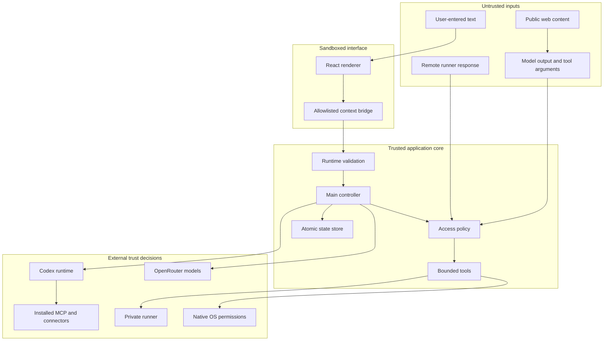

# Security and privacy

Grokky is a local desktop agent with explicit access to files, model providers, and optional computer controls. This document describes the trust model, protected assets, enforced boundaries, known limitations, and repository-publication rules.

Security claims here apply to the source in this repository. Unsigned local builds, third-party models, installed skills, MCP servers, connectors, and user-selected workspaces remain separate trust decisions.

## Security objectives

1. Keep provider credentials out of the renderer and repository.
2. Keep file and command tools inside the selected workspace.
3. Make sensitive actions visible, configurable, and auditable.
4. Prevent browser tools from becoming a private-network request primitive.
5. Prevent a paired runner from widening permissions beyond its startup boundary.
6. Keep local conversation state private to the operating-system user.
7. Fail closed when a capability, target, credential, or native permission is unavailable.

## Assets

| Asset | Sensitivity | Storage owner |
| --- | --- | --- |
| Codex sign-in material | Secret | Codex home, not Grokky state |
| OpenRouter API key | Secret | Process environment or user-selected env file |
| Runner bearer token | Secret | Runner private state; encrypted in Grokky state |
| Conversations and messages | Private user data | Electron user-data directory |
| Workspace files | Potentially private | User-selected workspace |
| Agent definitions | Potentially private | Codex personal or project agent folders |
| Codex configuration | Potentially sensitive | Codex home |
| Screen captures | Highly sensitive and ephemeral | Electron temp directory |
| Audit history | Private operational metadata | Grokky local state |

## Trust zones

Model-generated JSON arguments are untrusted even after schema validation. Every operation revalidates its own paths, sizes, mode, and target at execution time.

## Renderer isolation

The browser window uses a sandboxed renderer with context isolation and no Node integration. The preload exposes named methods only. Main-process IPC handlers validate IDs, messages, settings, agent drafts, URLs, pairing codes, access levels, and allowlists before invoking the controller.

Navigation protections:

- In-app navigation away from the loaded application is prevented.
- New windows are denied.
- Only `http` and `https` links may be handed to the operating system.
- The renderer cannot call `shell.openExternal` directly.

This reduces the impact of renderer compromise, but it is not a substitute for keeping Electron updated and reviewing any future webview, remote-content, or preload change.

## Credentials

### Codex

Grokky checks only for a readable Codex auth file. It does not parse, serialize, render, log, or copy its contents. The official SDK and local Codex runtime own authentication.

### OpenRouter

The API key is resolved in the main process from the inherited environment or a local env file. Only the credential source description appears in provider status. The selected file path may be persisted, so users should understand that the path itself can reveal folder naming inside local state even though it is not sent to the renderer as a key value.

The key is passed to the OpenRouter SDK and request headers only for the active run. It is not included in messages, activity items, usage, errors, repository files, or smoke-test fixtures.

### Remote runner

The runner creates a random bearer token and stores it with mode `0600`. Pairing uses a separate six-digit code, compared with constant-time logic and rotated after successful pairing. Grokky encrypts the bearer token using Electron `safeStorage` before persisting it. Decryption occurs only immediately before an authenticated runner request.

The test-only default secret adapter uses reversible base64 so unit tests can run outside Electron. Production app construction always injects the Electron `safeStorage` adapter.

## Workspace containment

Workspace paths must be relative. `resolveWorkspacePath` resolves the candidate, compares it with the canonical selected root, and rejects any path that leaves that root.

Additional file rules:

- Reads and edits require a regular file.
- Symlinks are skipped during discovery and rejected for direct reads or edits.
- Absolute paths are rejected.
- `.git`, dependencies, output, release, distribution, and build directories are excluded.
- Env files, auth files, credentials, npm and netrc config, SSH key names, PEM keys, and certificate containers are blocked.
- Reads are capped at 100,000 characters.
- Creates are capped at 200,000 characters and refuse overwrite.
- Edits require one unique exact match.
- File listings stop after 240 results.
- Search results and process output are capped.

These rules reduce accidental credential exposure and destructive edits. They do not classify arbitrary secrets stored in an innocently named source file. Users should still select a narrow workspace and review what it contains.

## Command execution

Commands require all of:

1. Workspace-write conversation mode
2. Conversation commands enabled
3. Computer access enabled
4. Commands capability available
5. Commands capability allowed for the action or chat
6. Remote runner `--allow-commands` when a remote device is selected

The command must begin with an allowlisted development prefix such as a test, build, read-only Git inspection, file listing, path display, or search command. The validator blocks shell composition, redirection, command substitution, network tools, deletion, privilege escalation, process control, and native automation.

Commands still run through `/bin/zsh -lc`, so every allowlist expansion must be treated as security-sensitive. Add the narrowest executable and argument shape possible, then add negative tests.

## Browser request safety

The Grokky-owned `browse_url` tool:

- Accepts only `http` and `https`
- Rejects credential-bearing URLs
- Resolves DNS before requesting
- Rejects a destination if any resolved address is private, local, link-local, carrier-grade NAT, or unique-local IPv6
- Repeats destination validation after redirects
- Requires either one-time target approval or a matching persistent domain allowlist entry
- Uses a 20-second timeout
- Accepts text, HTML, JSON, or XML only
- Caps the raw body and extracted text
- Removes scripts and styles before returning readable content

This is a bounded text fetcher, not a general browser. DNS rebinding defenses are limited because DNS is checked before fetch rather than socket-pinned. Do not use it as the sole isolation boundary in a hostile network environment.

## Native screen and automation

On macOS, Screen Recording protects screen capture and Accessibility protects app opening, coordinate clicks, and text entry. Grokky can request access and open System Settings, but cannot grant itself permission. Those native screen and automation tools remain unavailable on Windows; workspace files, safe commands, public browsing, providers, and orchestration are cross-platform.

Risk notes:

- A screenshot can contain credentials, private messages, or customer data.
- Coordinate-based clicking depends on current visible state and can target the wrong control if the interface moves.
- Typed text goes to the active application.
- Native Codex computer use is enabled only when the local computer is selected and screen plus automation capabilities are persistently allowed.

Use Ask mode for Grokky-owned OpenRouter tools unless continuous automation is intentional. Review visible state before approving clicks or typing.

## Remote runner

The runner is intentionally small. It has no provider credential and exposes only files plus optional commands.

Its permission is the intersection of:

- The fixed workspace root passed at startup
- `--allow-write`
- `--allow-commands`
- The requested conversation mode
- The requested conversation command setting
- Tool-level path and command validation

The protocol uses bearer authentication but does not provide TLS. Bind to loopback or an encrypted authenticated private overlay network. Do not bind to a public interface or forward the port from an internet gateway.

The unauthenticated health endpoint returns device name, platform, root, and capabilities. This is acceptable on the intended private transport but is another reason not to expose the runner publicly.

## Local persistence

`StateStore` writes JSON with mode `0600` to a temporary sibling and then renames it over the active file. The load path normalizes expected fields, limits collection sizes, restores defaults, and converts stale active agent states to stopped.

Local state contains private information, including messages, workspace paths, provider selection, selected agents, activity details, audit targets, and remote endpoint metadata. It is not committed, but any local backup or device-management system may copy it.

Deleting a conversation removes it from Grokky's state after cancelling active work. It does not securely erase prior filesystem blocks or copies held by backups, provider services, Codex home data, or workspace version history.

## Installed capability risk

Skills, MCP servers, and connectors execute through the Codex ecosystem and may introduce their own code, network, authentication, and data boundaries. Grokky can discover and toggle configured entries. It does not audit every third-party implementation.

Before enabling one:

- Review its source and declared permissions.
- Understand which credentials it can access.
- Prefer a project scope over a global scope when possible.
- Keep unrelated sensitive folders outside the selected workspace.
- Confirm the provider and plugin source are trusted.

## Repository publication gate

`npm run hygiene` scans source and documentation for:

- Absolute macOS, Linux, and Windows user-home paths
- Private tailnet hostnames
- Private-key headers
- Credential-shaped OpenAI and OpenRouter keys
- Em dashes, which are excluded by the product writing policy

Git also ignores:

- `.env` variants
- Auth and credential files
- Private keys and certificate containers
- Conversations and runner state
- Logs, coverage, builds, packaged releases, screenshots, and output
- Retired branding intermediates

This automated check is a backstop, not proof that a repository is anonymous. Before any public or cross-organization transfer, also inspect tracked filenames, Git history, image metadata, author metadata, issue links, and documentation links.

## Verification checklist

Before merging a security-sensitive change:

- [ ] Run `npm run verify`.
- [ ] Add a negative test for the rejected boundary.
- [ ] Confirm the renderer contract contains no secret value.
- [ ] Confirm persisted state contains no new plaintext credential.
- [ ] Confirm remote requests revalidate the boundary.
- [ ] Confirm an abort signal or timeout bounds the operation.
- [ ] Confirm output size is capped.
- [ ] Confirm errors do not echo sensitive input.
- [ ] Confirm the feature has an honest UI state and audit trail.

## Reporting

This is a private repository. Report suspected vulnerabilities privately to the repository owners. Do not open a public issue containing credentials, private paths, conversation data, screenshots, runner endpoints, or reproduction data from a real workspace.
