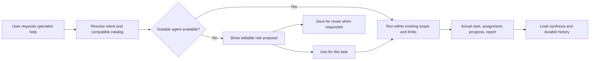

# Grokky experience audit

**Historical baseline.** See [0.1.7 implementation and verification](UI-POLISH-0.1.7.md) and the release evidence column in the [journey register](UX-JOURNEY-MAP.csv) for current coverage. Remaining environment checks are listed separately.

Follow-up: [0.1.5 provider experience improvements](UX-IMPROVEMENTS-2026-09-08.md) records implemented fixes and their verification. Findings below retain the original 0.1.4 baseline.

Audit baseline: desktop 0.1.4, application commit `b58304a`, checkout `9e76a7a` on `feat/phone-handoff`. This is an audit and implementation brief, not a claim that the proposed changes have shipped.

Grokky has a recognizable visual identity and substantial functionality. The biggest experience gap is that normal language, actual execution, and visible state do not consistently agree. Fixing that is the first priority. More decoration would leave the most frustrating journeys intact.

## Scope and evidence

- [Journey register](UX-JOURNEY-MAP.csv): 87 journeys covering controls, alternate paths, recovery expectations, and verification status.
- [Control inventory](UX-CONTROL-INVENTORY.csv): 193 source control sites, 176 desktop and 17 phone, across 29 component/surface owners. Repeated rows, mapped choices, and conditional states generate additional runtime controls. This is a source inventory, not 193 individually passed interaction tests.
- Fresh `npm run smoke:electron:full`: all 53 fixtures passed. These establish the harness's layout and interaction assertions at its listed viewports, not universal accessibility, latency, or end-to-end correctness.
- Installed-app conversations exercised Codex without crew selection, agent suggestions, OpenRouter without selection, and a selected-crew comparison. Exact outcomes are below.
- Installed-app navigation reproduced lost drafts and inspected the preflight access menu. Nine fresh fixture screenshots were visually reviewed: agent editor, agents, crew tasks, routines, light theme, phone pairing, computer settings, model picker, and image composition.
- Private screenshots and test evidence are in ignored `output/ux-audit-2026-09-08/`. Public documentation deliberately omits personal conversations, local project paths, runtime thread IDs, and signed URLs.

This map covers the implemented product surface and major state transitions. It cannot enumerate every possible natural-language input or every device/network permutation. Pending checks are explicit. No hardware, performance percentile, or remote-CI pass is implied by source inspection.

## What happens when the user asks for agents?

| Scenario | Observed result | Implication |
| --- | --- | --- |
| Codex, Solo, “Please spin up two agents” for a fictional gardening-club naming task | Send opens the access picker and demands Full access. The model never receives the request. Reproduced twice with different text. | A normal agent request is misclassified as starting a development server. |
| Codex, Solo, equivalent “Please delegate to two agents” wording | Two successful native child starts and two final reports exist in this test's root runtime record. The final names both findings. Grokky persists zero agent runs and displays no crew panel. | The runtime can delegate naturally; the product fails to observe and expose it. |
| Codex, Solo, request a new naming specialist proposal | Returns prose describing a new specialist, but refers to a service in the selected project when choosing the closest fit. Only Copy and Reply are offered. No agent proposal card or creation affordance appears. | Catalog grounding and a chat-to-agent workflow are missing. This test requested a proposal only; persistent creation was not attempted. |
| OpenRouter, Solo, agent request with “do not use ... browser” | Enters the browser completion workflow and attempts unrelated navigation. The browser permission was denied and the test stopped. | Negated words incorrectly activate a stronger system workflow. |
| OpenRouter, Solo, clean text-only follow-up without browser keywords | Explicitly says real delegation is unavailable. Chat shows Blocked while Watch shows Completed / Work delivered. | No natural agent selection; conflicting outcome language compounds the failure. |
| OpenRouter, explorer and tester manually selected, default `openai/gpt-5.2` model | Request fails before any specialist starts: the strict `delegate_to_agent` schema omits `constraints` from its required list. Raw provider schema error appears in chat. | Even the explicit-selection path is broken for this tested model. Picker and natural-language paths both need live coverage. |

## Prioritized findings

P1 means fix before presenting the experience as a polished conversational agent product. P2 means address in the next experience pass. P3 means a follow-up improvement or unmeasured engineering risk. Source references describe this audit baseline.

| ID | Priority / evidence | Finding and cause | Acceptance test |
| --- | --- | --- | --- |
| F01 | P1, live + source | “Spin up agents” triggers command preflight. `src/shared/run-preflight.ts:3` matches bare `spin up`; renderer and controller both enforce it. | Agent wording submits in read-only mode; genuine requests to start a development server still require command access. Test negations, quotations, mixed requests, singular/plural, and named roles. |
| F02 | P1, live + runtime record + source | Natural Codex children are invisible. `codex-provider.ts:421` starts the rollout observer only when `context.agents.length > 0`. | With Solo selected, two actual child starts become named rows, assignments, reports, and archived history. No fabricated rows from prose. Also test failure, cancellation, unknown roles, resume, and duplicate events. |
| F03 | P1, live + source | OpenRouter has no delegation tool when no agents are selected. `openrouter-provider.ts:698` and `controller.ts:1084` limit the roster to selected IDs. | An explicit request for suitable specialists resolves against available compatible agents, respects the global toggle and cap, and delegates within current permissions. Unsupported work gets an actionable explanation. |
| F04 | P1, live + source | Negated browser wording activates a browser-only completion requirement. `openrouter-provider.ts:708` matches nouns without negation handling. | A text-only request mentioning that browsing is forbidden produces no browser classification or completion gate. Positive interactive-browser tasks retain evidence and completion requirements. |
| F05 | P1, live + source | Switching conversations silently destroys an unsent draft. `App.tsx:1397` resets draft and image state on conversation ID change. | Draft text, attachments, cursor, and scroll survive A to B to A. Sending clears only that conversation's draft. Deletion and image URL cleanup stay correct. Define restart persistence separately. |
| F06 | P1, live + source | “Blocked” in chat conflicts with “Completed / Work delivered” in Watch. | One normalized outcome drives chat, sidebar, crew, Watch, archived seats, and attention. Blocked, stopped, failed, indeterminate, and completed remain distinct. |
| F07 | P2, live + source | Agent suggestions are disconnected prose and can be grounded in the wrong catalog. Agent creation is exposed through settings IPC, not a typed proposal flow. | A catalog-grounded proposal shows role, scope, permissions, provider support, and reuse choice. Use for this task, edit, save for reuse, and dismiss are explicit actions. Saving is distinct from spawning. |
| F08 | P2, live + visual + source | Watch opens automatically for every new seat, including text-only Codex tasks. The generic placeholder says “Cloud computer ready” for a local SDK session. See `App.tsx:2284` and the automatic Watch effect. | Default to conversation plus compact real activity. Open Watch on user request or relevant visual work. Show accurate local/remote and available/unavailable copy. Preserve deliberate panel preferences. |
| F09 | P2, live + source | Access picker Escape did not dismiss during preflight. It has outside-pointer handling but no Escape/focus-return path. | All menus support consistent Escape, focus return, keyboard selection, outside click, and nested-layer priority. Closing a menu must not widen permissions. |
| F10 | P2, source | `ModelCombobox` supports Enter/Escape but lacks ArrowUp/ArrowDown active-option navigation. FeatureCenter has `aria-modal` but no focus containment/restoration. Search-clear and weekday controls need better names. | Keyboard-only completion for every journey; focus remains visible and in modal layers; weekday names are unambiguous. Verify with actual assistive technology, not labels alone. |
| F11 | P2, fresh screenshot | At 1440x900 with phone Watch open, composer help wraps into a narrow vertical stack and competes with the mascot. Header model/reasoning controls also crowd. The fixture passes. | Check descendant text bounds and readable line counts, not only outer boxes. At all supported widths, send/stop/access remain reachable, hints fit or collapse, and the composer never overlaps its footer. |
| F12 | P2, source | MessageList forcibly scrolls to the bottom when activity, agent counts, or status changes, regardless of reading position (`App.tsx:538`). | Follow output only while pinned to the bottom. Preserve a user's reading anchor; show an accessible new-content affordance. Test growing tables and historical crew expansion. |
| F13 | P2, visual + source | Crew setup mixes global orchestration settings, templates, and the actual roster in one long modal. “Crew,” “Agents,” “Control room,” and “Work control” describe overlapping concepts. | Keep task-level selection near the composer; put reusable agent management and global settings in clearly named locations. A new user can find, inspect, select, and reuse a role without reading implementation terminology. |
| F14 | P2, visual + source | Visual hierarchy overuses accent borders, clipped corners, small uppercase metadata, and nested containers. Routine creation uses different form/button conventions from agent creation. | Use one spacing/type/control system across settings, crew, routines, and phone. Accent identifies action, focus, and meaningful state. Secondary metadata is legible at normal scale in every theme. |
| F15 | P2, source | Several actions lack local pending/error feedback; new-session creation has no rejection handler at its button. Routine deletion uses `window.confirm`, unlike chat deletion. | Every mutation has immediate acknowledgment, duplicate-submit protection, local error recovery, and preserved input. Use a consistent confirmation pattern only for consequential actions. |
| F16 | P3, source; performance unmeasured | Three imported CSS files total 12,026 lines; App.tsx is 2,996 lines. Full snapshots and store saves are on event/update paths. This creates maintenance and possible responsiveness risk, not proof of slowness. | Profile before optimization. Extract components and consolidate styles incrementally under screenshot and interaction coverage. Preserve durable audit-before-action semantics. |
| F17 | P1, live + source | Manual OpenRouter delegation fails schema validation. `openrouter-provider.ts:290` declares four properties with `strict: true`, but requires only agent and task. The tested model rejects missing required constraints; expecting is also omitted. | Validate every offered strict schema before dispatch; make optional semantics compatible with the provider contract. Run the two-agent control on the default model and assert actual starts/reports. Translate provider failures into useful product errors without hiding technical detail. |

## Target experience

### Conversation first

The default should make asking the next question effortless. Keep the mascot identity, familiar native typography, selectable accent palettes, readable tool evidence, and provider honesty. Do not introduce a generic dashboard, gratuitous motion, or a framework rewrite.

Use one stable conversation column with a consistent composer. Make scope and access easy to inspect without making every message feel like configuration. Keep provider/model settings discoverable; do not silently change them. Secondary activity should summarize what is happening and expand into evidence. A local text task should not spend a third of the window displaying an empty computer screen.

### Natural agent workflow

Separate three concepts: **requesting work**, **selecting a reusable role**, and **saving a new agent definition**. An explicit request to delegate should not require redundant picker clicks. Creating persistent definitions should be a deliberate action. Do not promise identical tool support between providers. Do not give a generated role broader access than the task already has.

The roster needs capability descriptions and compatible providers, not only generic explorer/worker names. The first version can use deterministic catalog matching plus bounded model assistance for ambiguous descriptions. The main process must validate proposed roles, enforce limits, and own lifecycle state. The renderer only displays observed results and reviewable proposals.

### Details to standardize

These are proposed design specifications, not measured current values:

| Area | Target |
| --- | --- |
| Typography | Native system family retained; 14-15px primary controls/body, 12-13px secondary text, larger restrained headings; tabular numbers for elapsed time and usage. Avoid tiny essential instructions. |
| Spacing | A 4/8/12/16/24/32 scale with optical corrections. Stable 36-40px desktop primary control height; generous phone touch targets. Compact density is intentional, not accidental compression. |
| Surfaces | Neutral canvas, one panel elevation, one overlay elevation. Retain branded corners selectively. Use borders for boundaries and state, not around every text group. |
| Motion | Immediate pressed/focus feedback; roughly 120-160ms menu/hover response, 160-220ms panel transitions. Prefer opacity/transform. No stagger that delays usable controls. Reduced motion skips movement and looping ornament. |
| Loading | Specific phases: accepted, connecting, waiting for model, working, waiting for permission, stopping. Keep cancellation available. Never invent percentage progress. |
| Errors | Explain what failed, whether anything happened, and what can be retried. Keep drafts and user choices. Indeterminate actions must not be blindly replayed. |
| Empty states | Tailored to task/provider: new conversation, no agents, no matching roles, no frames, unsupported local observation, offline device, no routines, resolved attention. |
| Accessibility | Visible keyboard focus, meaningful names, dialog containment, readable zoom, keyboard-equivalent resize, reduced motion, and screen-reader announcements that do not repeat every activity event. |

## Latency verification plan

Do not report “instant” or a percentage improvement from animation duration or a single model call. Separate local input responsiveness, IPC/persistence, provider startup, model waiting, tool execution, and phone transport.

| Measurement | Proposed acceptance target | Procedure |
| --- | --- | --- |
| Click/keypress to visible acknowledgment | p95 at or below 100ms on declared reference hardware | Instrument event timestamp to next painted acknowledgment, 30 repetitions per action after warmup. Include new session, switch, menu, save, send, stop. |
| Local menu/tab/switch action | p95 settled state at or below 200ms | Record main-thread tasks and frame timing. Distinguish an animation still playing from an unusable control. |
| Typing and resizing | No visible dropped input; no repeated long tasks above 50ms | Exercise long histories, 8 agents, growing activity, tables, images, and Watch at the same time. |
| Send | Immediate accepted state; separately record first provider event and first content | Record cold/warm provider paths, setup failure, offline behavior, and large attachment preparation. |
| Stop | Immediate “Stopping” acknowledgment; measure cancellation and teardown separately | Test model wait, tool wait, approval, queued follow-up, and phone ownership. Never show idle before cleanup responsibility is resolved. |
| Phone command | Immediate pending feedback; measure receipt latency separately | Polling is currently 1.5 seconds desktop / 2 seconds phone. Do not set a desktop-like network completion promise. Profile before changing transport. |

Full-state serialization and synchronous render work are profiling candidates. Optimizations must not move credential ownership into React, lose completion evidence, skip audit writes, or merge human phone content into model context.

## Implementation order and release gates

1. **Intent and truth:** F17, F01-F04, and F06. Repair the selected-crew schema, then add natural-language regression cases plus observation coverage for unselected Codex children. Retain provider-specific behavior. Gate on actual child evidence, not final-answer claims.
2. **Conversation continuity:** F05, F08-F12, F15. Preserve drafts and scroll; correct Watch visibility/copy; normalize overlays and pending states. Gate on keyboard journeys, rerender races, and compact layouts.
3. **Agent workflow:** F07 and F13. Catalog-grounded suggestions and editable proposals, task-scoped use, deliberate save for reuse. Gate on provider compatibility, explicit selection overrides, limits, cancellation, and persistence.
4. **Visual system and performance:** F14-F16. Refine shared components in small slices with before/after screenshots, measured local responsiveness, every theme/accent, and reduced motion. Keep a single authoritative style owner for each changed component.
5. **Release hardening:** physical iPhone/Android, native Windows installation, cold start/restart/offline, long sessions, cloud teardown and phone reconnection. Packaging and deployment follow the repository's normal ordering.

For each implementation slice, run the required root verification and relevant Electron fixtures. Gateway/phone changes also require their documented checks. Use narrowly scoped live provider checks after deterministic tests. Version behavior changes, inspect the full diff, preserve the installed rollback, and keep evidence private.

## Remaining verification

No hardware or percentile performance measurements were made in this audit. Physical phone behavior, 200% zoom, screen-reader use, all accent/theme combinations across every surface, multi-window/restart draft behavior, very long histories, live provider failures, and sustained resize/typing during active work remain pending. The journey register is the execution checklist for those checks.

The phone fixture's embedded dummy Live View displays a host-denied page. That is not evidence that production streaming is broken; use a deterministic local stream fixture for visual QA and separately verify the authenticated production path when warranted.
